<!-- TOC -->
- [每日练习](#每日练习)
	- [靠墙上举手臂 / Wall Angels](#靠墙上举手臂--wall-angels)
	- [跪姿抱头侧转 / Quadruped Thoracic Rotation](#跪姿抱头侧转--quadruped-thoracic-rotation)
	- [猫牛式 / Cat-Cow Pose](#猫牛式--cat-cow-pose)
- [热身动作](#热身动作)
	- [肩部](#肩部)
	- [背部](#背部)
	- [臀腿](#臀腿)
- [肩部 / Shoulders](#肩部--shoulders)
	- [肩外旋 / Band external shoulder rotation](#肩外旋--band-external-shoulder-rotation)
	- [阿诺德推肩 / Arnold Press](#阿诺德推肩--arnold-press)
	- [坐姿器械推肩 / Lever Seated Shoulder Press](#坐姿器械推肩--lever-seated-shoulder-press)
	- [哑铃侧平举 / Dumbbell Lateral Raise](#哑铃侧平举--dumbbell-lateral-raise)
- [肱二头肌 / Biceps](#肱二头肌--biceps)
	- [直杆弯举 / Cable Bicep Curl Standards](#直杆弯举--cable-bicep-curl-standards)
	- [杠铃弯举 / Barbell Curl](#杠铃弯举--barbell-curl)
	- [哑铃弯举 / Dumbbell Curl](#哑铃弯举--dumbbell-curl)
- [肱三头肌 / Triceps](#肱三头肌--triceps)
	- [绳索三头肌下压 /Cable Triceps Pushdown](#绳索三头肌下压-cable-triceps-pushdown)
	- [坐姿哑铃颈后臂屈 / Dumbbell Seated Triceps Extension](#坐姿哑铃颈后臂屈--dumbbell-seated-triceps-extension)
- [背部 / Back](#背部--back)
	- [辅助引体向上 / Assisted Pull-up](#辅助引体向上--assisted-pull-up)
	- [宽距高位下拉 / Cable Wide-Grip Lat Pulldown](#宽距高位下拉--cable-wide-grip-lat-pulldown)
	- [颈后高位下拉 / Grip Rear Pulldown Behind Neck](#颈后高位下拉--grip-rear-pulldown-behind-neck)
	- [杠杆交叉背阔肌下拉 / Lever Cross Lat Pulldown](#杠杆交叉背阔肌下拉--lever-cross-lat-pulldown)
	- [单臂高位下拉 / (Cable) One Arm Lat Pulldown](#单臂高位下拉--cable-one-arm-lat-pulldown)
	- [坐姿划船 / Low Seated Row](#坐姿划船--low-seated-row)
	- [T 杆划船 / Lever T-bar Row](#t-杆划船--lever-t-bar-row)
	- [罗马椅伸展 / Roman Chair Extension](#罗马椅伸展--roman-chair-extension)
	- [单臂哑铃划船 / One Arm Bent-over Row](#单臂哑铃划船--one-arm-bent-over-row)
	- [直臂下压 / Cable Straight Arm Pulldown](#直臂下压--cable-straight-arm-pulldown)
- [胸部 / Chest](#胸部--chest)
	- [杠铃卧推 / Barbell Bench Press](#杠铃卧推--barbell-bench-press)
- [腹部 / Waist](#腹部--waist)
	- [前平板支撑 / Front Plank](#前平板支撑--front-plank)
	- [船长椅直腿抬高/ Captains Chair Straight Leg Raise](#船长椅直腿抬高-captains-chair-straight-leg-raise)
	- [俄罗斯转体 / Russian Twist](#俄罗斯转体--russian-twist)
	- [V 型仰卧起坐 / V-Up](#v-型仰卧起坐--v-up)
	- [负重上举/ 负重卷腹 / Weighted Sit-Up / Weighted Crunch](#负重上举-负重卷腹--weighted-sit-up--weighted-crunch)
	- [仰卧抬腿 / Lying Leg Raise](#仰卧抬腿--lying-leg-raise)
	- [罗马椅负重侧腹 / Weighted Side Bends on Roman Chair](#罗马椅负重侧腹--weighted-side-bends-on-roman-chair)
- [臀腿](#臀腿-1)
	- [概述](#概述)
	- [深蹲 / Squat](#深蹲--squat)
	- [高脚杯深蹲 / Goblet Squat](#高脚杯深蹲--goblet-squat)
	- [史密斯相扑深蹲 / Smith Sumo Squat](#史密斯相扑深蹲--smith-sumo-squat)
	- [反向哈克机深蹲 / Lever Reverse Vertical Hack Squat](#反向哈克机深蹲--lever-reverse-vertical-hack-squat)
	- [史密斯硬拉 / Smith Deadlift](#史密斯硬拉--smith-deadlift)
	- [坐姿腿屈伸 / Lever Leg Extension](#坐姿腿屈伸--lever-leg-extension)
	- [坐姿腿弯举 / Lever Seated Leg Curl](#坐姿腿弯举--lever-seated-leg-curl)
	- [器械倒蹬 / Lever Seated Leg Press](#器械倒蹬--lever-seated-leg-press)
	- [坐姿髋外展 / Lever Seated Hip Abduction](#坐姿髋外展--lever-seated-hip-abduction)
	- [坐姿髋内收 / Lever Seated Hip Adduction](#坐姿髋内收--lever-seated-hip-adduction)
	- [哑铃保加利亚分腿深蹲 / Dumbbell Bulgarian Split Squat](#哑铃保加利亚分腿深蹲--dumbbell-bulgarian-split-squat)
	- [哑铃箭步蹲 / Dumbbell lunge](#哑铃箭步蹲--dumbbell-lunge)
	- [箭步蹲加转体 / Lunge with Twist](#箭步蹲加转体--lunge-with-twist)
- [有氧 / Cardio](#有氧--cardio)
	- [战绳](#战绳)
- [肌肉](#肌肉)
- [注意点](#注意点)
	- [健身发力感 tips](#健身发力感-tips)
- [相关链接](#相关链接)
<!-- /TOC -->

# 每日练习

## 靠墙上举手臂 / Wall Angels

目的：改善头前伸、圆肩，激活上背肌群

4 组，每组 12 到 20 个

- 后脑勺、肩胛骨、臀部贴墙，保持自然直立姿势
- 双脚与肩同宽或略窄，脚跟距墙约10~15厘米，不需要贴墙，可略微向外打开
- 双臂抬起，肘部弯曲约90度，手肘、前臂、手背尽量贴墙
- 吸气准备，呼气时沿墙面缓慢将手臂向上滑动，至极限位置
- 吸气下放手臂回到起始位置，同时轻轻收紧肩胛骨向脊柱靠拢，避免耸肩或塌腰
- 整个过程保持身体与墙面贴合，不耸肩、不拱腰

## 跪姿抱头侧转 / Quadruped Thoracic Rotation

目的：改善胸椎（上背部）灵活性，纠正因久坐或姿势不良导致的脊柱活动受限

每侧 3 组，每组 8 到 12 个

- 双膝跪地，双手撑地，手腕在肩膀正下方，膝盖在髋部正下方，保持大腿和手臂垂直地面
- 目视地面，脊柱自然延展
- 一只手掌贴于同侧耳后或后脑勺，肘部展开
- 吸气准备，呼气时旋转该侧手肘向上，带动上半身和头部向上旋转，目视肘部方向
- 转至最大舒适幅度后，吸气还原
- 做完一侧后换另一侧

## 猫牛式 / Cat-Cow Pose

目的：改善脊柱灵活性与控制力，缓解背部僵硬与紧张

4 组，每组 8 到 12 个

- 双腿跪下，双手撑地，注意手腕位于肩膀正下方，膝盖在髋部正下方，大腿和手臂都与地面垂直
- 目视地面，保持颈部自然延展
- 吸气：抬头向前看，胸部打开，背部下沉，臀部上翘
- 呼气：低头看向腹部，背部拱起，腹部收紧（猫式）
- 两种姿势交替流动，重复至完成一组

# 热身动作

## 肩部

### 弹力带绕肩（前后）

目的：肩部灵活性训练（拉伸肩前束和胸小肌）

1 组，每组 15 到 20 个

- 双手握住弹力带两端
- 双脚打开约 1.5 倍肩宽
- 整个过程中肘关节伸直锁定
- 始终保持弹力带张力
- 双胳膊从大腿前侧开始绕过头顶一直向后向下拉，拉到拉不动的地方再回

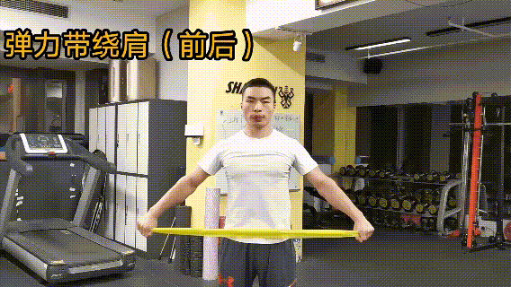

### 弹力带绕肩（对角线）

目的：肩部灵活性训练

顺时针和逆时针各10次，1-2组

- 肘关节伸直锁定
- 始终保持弹力带张力

## 背部

### 弹力带下拉

目的：激活上背部肌群

每组10次，1-2组

- 始终保持弹力带张力

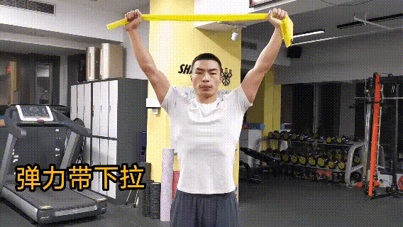

### 弹力带颈后下拉

目的：激活上背部肌群

1 组，每组 15 到 20 个

- 双手握住弹力带两端
- 双脚打开约 1.5 倍肩宽
- 双手伸直举过头顶，拉住弹力带向后夹背，双胳膊成 W 状
- 整个过程中不要低头

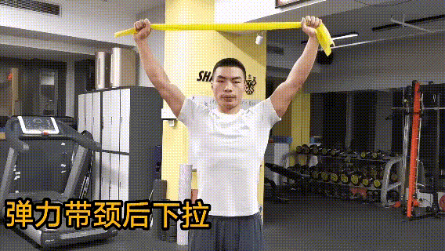

### 弹力带后拉

目的：激活中背部肌群

每组10次，1-2组

- 肩膀下沉，不要耸肩
- 肩胛骨后缩夹紧
- 大拇指朝后
- 始终保持弹力带张力

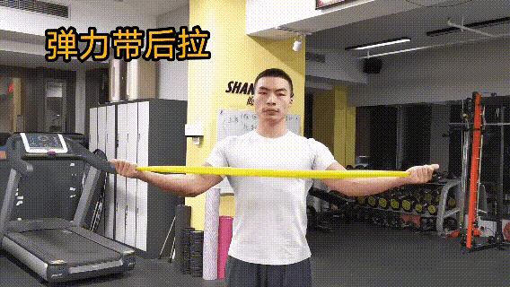
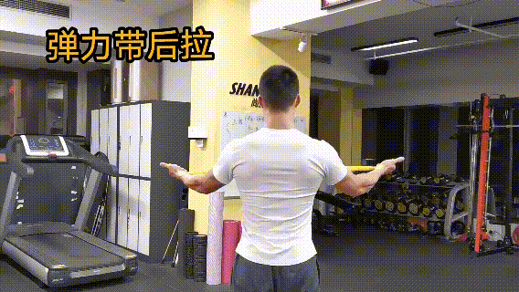

## 臀腿

### 蜘蛛侠式弓步旋转拉伸 / Spiderman Lunge to Thoracic Rotation

目的：激活髋屈肌、臀部、股四头肌，上半身旋转可唤醒核心 + 胸椎灵活性，适合跑步、深蹲等训练前使用

双腿各 1 组

- 左腿向前弓步，髋部向下压
- 右手撑地，左手沿躯干向上向后旋转，带动肩膀和头部一起转
- 保持髋部稳定不晃动，重复 5 次后换边

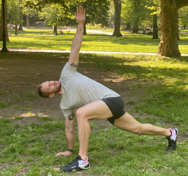

### 交叉压腿触脚尖 / Rotating Toe Touches

目的：同时拉伸腿后侧、激活核心旋转控制的全身热身动作，为下肢或全身训练前做动态准备

1 组

- 站姿，双脚略宽于肩，膝盖保持伸直
- 双手平举至两侧
- 右手去触左脚尖，上身顺势旋转，左手朝天
- 回到中间，再左手触右脚尖
- 控制节奏，左右交替做满 20 次

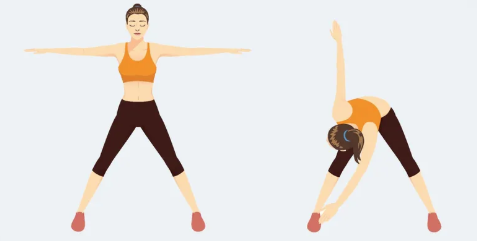

### 高抬腿击掌 / High Knees with Clap

目的：提升心率，激活核心和髋部，改善髋屈肌活动度和神经反应，适合放在热身末段，提高肌肉温度

1 组

- 原地高抬腿跑动，双手举在胸前或头前
- 每次抬腿时，膝盖尽量靠近手掌做击掌
- 保持躯干稳定，节奏均匀做 30 次

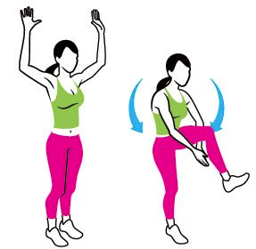

### 直腿胯下击掌

目的：拉伸下肢和背部的肌肉，提高身体柔韧性和协调性

1 组，每组 20 个

- 自然站立，挺胸抬头目视前方，双手张开在身体两侧

- 膝盖微屈，交替向正前方踢腿至最高点，同时双臂向下在大腿下方击掌

- 上身保持稳定，不要弯腰

- 自然呼吸即可

- 大腿后侧有牵拉感，抬腿时腹部有发力感

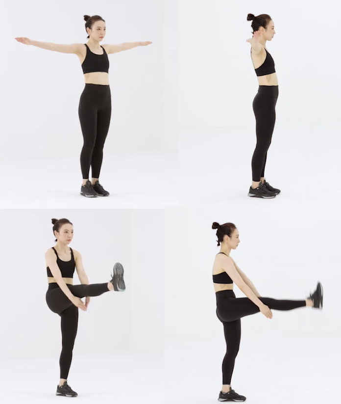

# 肩部 / Shoulders

## 肩外旋 / Band external shoulder rotation

目的：激活和强化肩袖肌群

每侧 4 组，每组 12-20 个

- 双脚打开站立，略微比肩膀宽即可，保持稳定
- 一侧手正握把手，该侧大臂紧贴躯干，保持稳定不要晃动，握住器械，小臂平行于地面向外展开，初始状态是小臂垂直于身体正面，最终需要外展到小臂垂直于身体侧面
- 另一侧手可以背着放，一方面可以保持稳定，另一方面也可以保证该侧肩也处于打开状态
- 快拉慢放

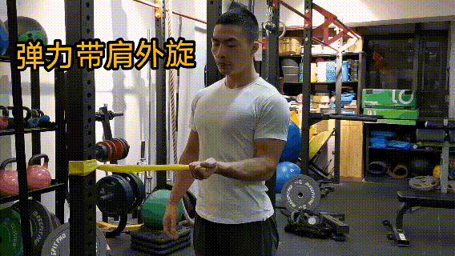

### 训练记录

- 2025 年 03 月 21 日，每侧 3 组，2.5kg
- 2025 年 03 月 27 日，每侧 3 组，2.5kg，每组 12 个
- 2025 年 06 月 16 日，每侧 4 组，2.5kg，每组 15 个
- 2025 年 06 月 18 日，每侧 4 组，2.5kg，每组 15 个
- 2025 年 07 月 10 日，每侧 4 组，5kg，每组 3 个

### 动作参考

- [https://lyfta.app/zh-CN/ex/6yb](https://lyfta.app/zh-CN/ex/6yb)

## 阿诺德推肩 / Arnold Press

目的：全面锻炼肩部三角肌，尤其是前束和侧束，同时激活肩袖肌群，提升肩关节稳定性

4 组，每组 12 到 20 个

- 坐在椅凳上，肩部靠住背靠，但是腰背挺直，不要往后塌、也不要往前弓肚子
- 双手举起哑铃，注意手肘倾斜大概 10° 左右
- 往上推起举过头顶
- 双脚要支撑住

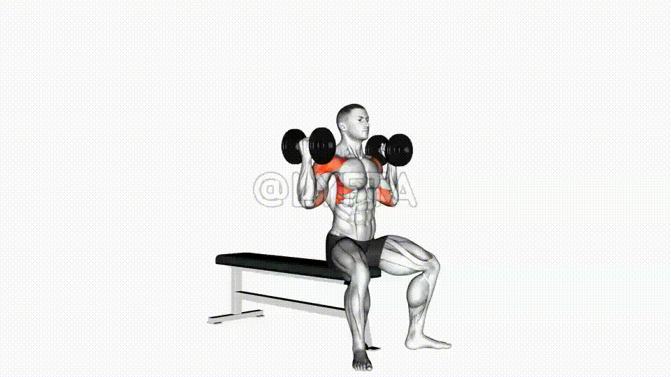

### 训练记录

- 2025 年 03 月 09 日，2.5kg * 2
- 2025 年 04 月 17 日，4 组，2.5kg *2，每组 12 个

### 动作参考

- [https://lyfta.app/zh-CN/ex/83](https://lyfta.app/zh-CN/ex/83)

## 坐姿器械推肩 / Lever Seated Shoulder Press

目的：强化肩部三角肌，尤其是中束和前束，提升肩部的稳定性和控制能力

4 组，每组 12 到 20 个

- 坐在训练凳上，调整好座椅高度，背部靠在椅背上，腰部因为有弧度不可能靠在椅背上
- 正握（注意不要参考图，因为图中不是正握）手掌朝前握住手柄，小手臂垂直于地面
- 往上推至最高点，过程中保持小手臂垂直于地面
- 往下落的时候注意一直往下落，不要只落回一点点，不然运动轨迹过短，运动效果不佳，另外回落过程中也要保持小手臂垂直于地面

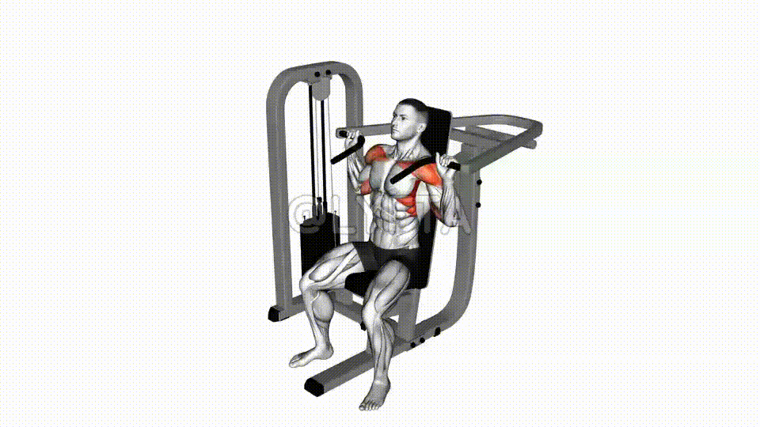

### 训练记录

- 2025 年 03 月 06 日，最小重量
- 2025 年 03 月 14 日
- 2025 年 05 月 10 日，3 组，每组 12 个，最小重量
- 2025 年 06 月 25 日，4 组，每组 12 个，最小重量，但是最后 1 组只能推起来 3 个，后面几个大部分由教练辅助

### 动作参考

- [https://lyfta.app/zh-CN/ex/fg](https://lyfta.app/zh-CN/ex/fg)

## 哑铃侧平举 / Dumbbell Lateral Raise

目的：主要锻炼肩部三角肌的侧束（中间部分），帮助塑造宽肩线条，改善肩部的稳定性和控制力

4 组，每组 12 到 20 个

- 双脚与髋部同宽站立，保持腰背挺直，略微往前倾斜，沉肩胛，手腕悬前，手肘微屈
- 双手握住哑铃，放于大腿前，手背侧朝向前
- 注意用肩部的力量将哑铃举起来，胳膊不要使劲
- 最终达到的最高点是，双手不超过手肘，手肘不超过肩膀
- 快举，慢回
- 注意：上述文字描述和图中略有不同，以文字描述为准

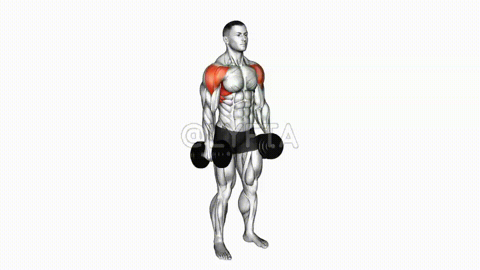

### 训练记录

- 2025 年 03 月 14 日
- 2025 年 06 月 25 日，2.5kg * 2，4 组，每组 12 个
- 2025 年 07 月 25 日，2 kg，4 组，每组 15 个

### 动作参考

- [https://lyfta.app/zh-CN/ex/6iq](https://lyfta.app/zh-CN/ex/6iq)

# 肱二头肌 / Biceps

## 直杆弯举 / Cable Bicep Curl Standards

目的：主要锻炼肱二头肌，增强手臂力量和肌肉轮廓。相比自由重量，滑轮提供持续张力，有助于整个动作范围内保持肌肉激活

4 组，每组 12 到 20 个

- 双脚与髋同宽站立，核心收紧，保持身体稳定
- 双手正握直杆，握距略宽于肩或与肩同宽
- 抬头挺胸，固定大臂在身体两侧，不借力摆动
- 将横杆弯举至胸前，集中收缩肱二头肌
- 快提慢放：提起时呼气，控制下放时吸气

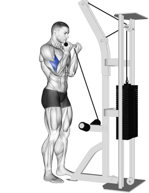

### 训练记录

- 2025 年 05 月 18 日，4 组，每组 12 个，5kg
- 2025 年 06 月 07 日，4 组，每组 12 个，5kg

### 动作参考

- [https://www.youtube.com/watch?v=rfRdD5PKrko](https://www.youtube.com/watch?v=rfRdD5PKrko)
- [https://strengthlevel.com/strength-standards/cable-bicep-curl/lb](https://strengthlevel.com/strength-standards/cable-bicep-curl/lb)

## 杠铃弯举 / Barbell Curl

目的：锻炼肱二头肌。

4 组，每组 12 到 20 个

- 双脚与髋同宽站立，核心收紧，保持身体稳定
- 双手握住杆，握距与身体同宽即可
- 双手自然垂直，手臂内侧朝前
- 抬头挺胸，固定大臂在身体两侧，不借力摆动
- 将杠铃弯举至胸前，集中收缩肱二头肌
- 快提慢放：提起时呼气，控制下放时吸气
- （图中的抓握方式略不同，以上述文字为准）

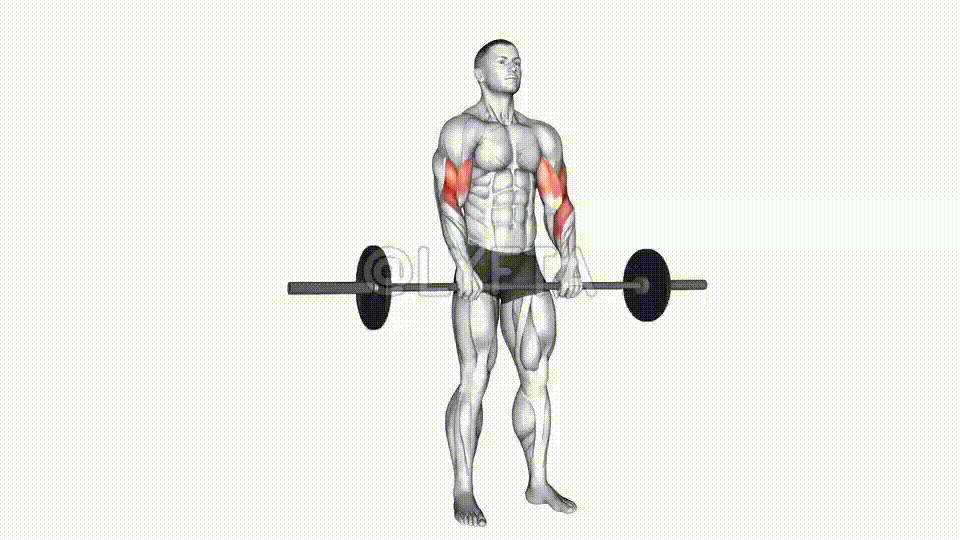

### 训练记录

- 2025 年 06 月 29 日，3 组，每组 12 个，10kg

### 动作参考

- [https://lyfta.app/zh-CN/ex/1](https://lyfta.app/zh-CN/ex/1)

## 哑铃弯举 / Dumbbell Curl

目的：锻炼肱二头肌，或者根据不同变式加强肱肌和肱桡肌。

4 组，两只手臂可以一个一个交替，每组 12 到 20 个

- 双脚与髋同宽站立，核心收紧，保持身体稳定
- 双手握住哑铃，握距与身体同宽即可
- 双手自然垂直，手臂内侧朝前
- 抬头挺胸，固定大臂在身体两侧，不借力摆动
- 将哑铃弯举至胸前，集中收缩肱二头肌
- 快提慢放：提起时呼气，控制下放时吸气

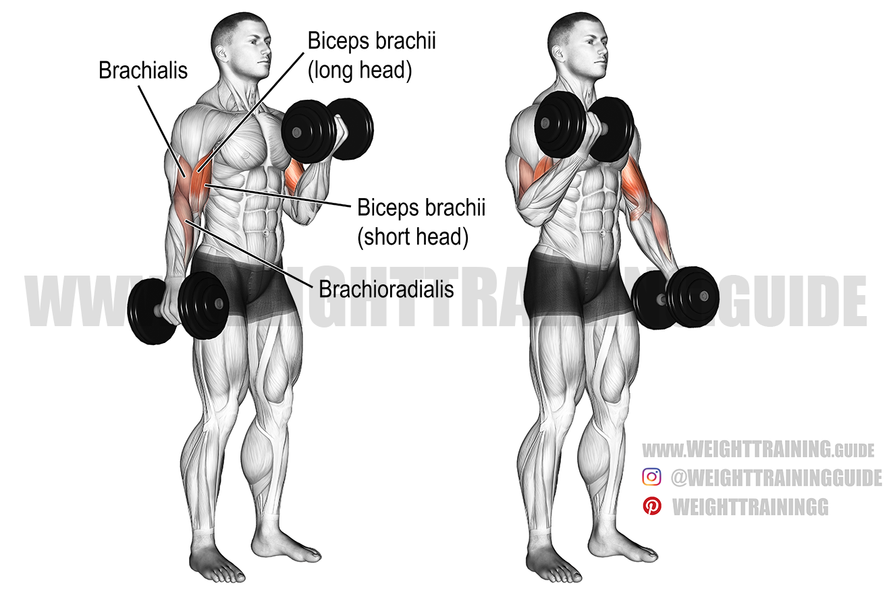

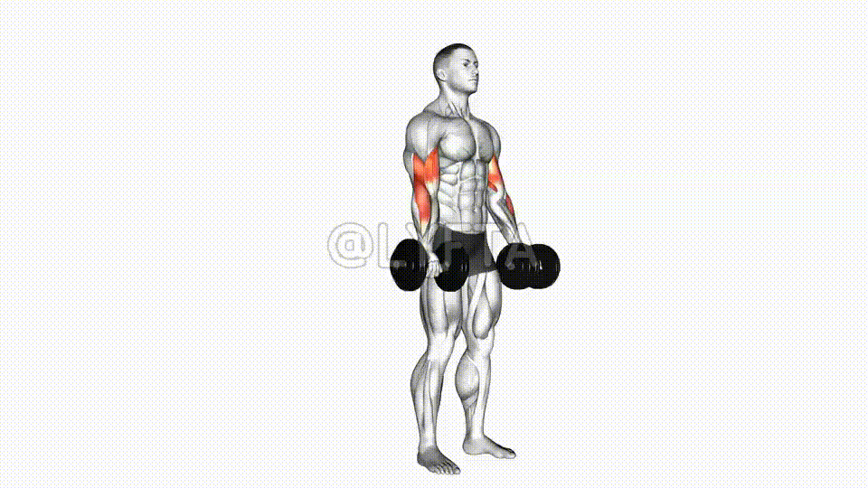

### 训练记录

- 2025 年 06 月 29 日，1 组，每一只手 4 kg，交替各 12 个
- 2025 年 08 月 24 日，每侧各 4 组，7.5lb（3.4kg），每组 15 个

### 动作参考

- [https://weighttraining.guide/exercises/dumbbell-curl/](https://weighttraining.guide/exercises/dumbbell-curl/)
- [https://lyfta.app/zh-CN/ex/8j](https://lyfta.app/zh-CN/ex/8j)

# 肱三头肌 / Triceps

## 绳索三头肌下压 /Cable Triceps Pushdown

目的：主要锻炼肱三头肌（上臂后侧肌肉），增强手臂推力和线条感，改善肘关节的稳定性和力量

4 组，每组 12 到 20 个

- 手掌朝下抓住杠铃，双手与肩同宽，双脚也与肩同宽
- 保持肘部靠近身体并弯曲它们以形成 90 度角，这是起始位置
- 伸展肘部并收缩三头肌，将杠铃向下推，大臂不要离开躯干，保持躯干稳定不要晃动
- 快拉慢回，慢慢回到起始位置，确保控制动作，不要让配重片在重复次数之间接触

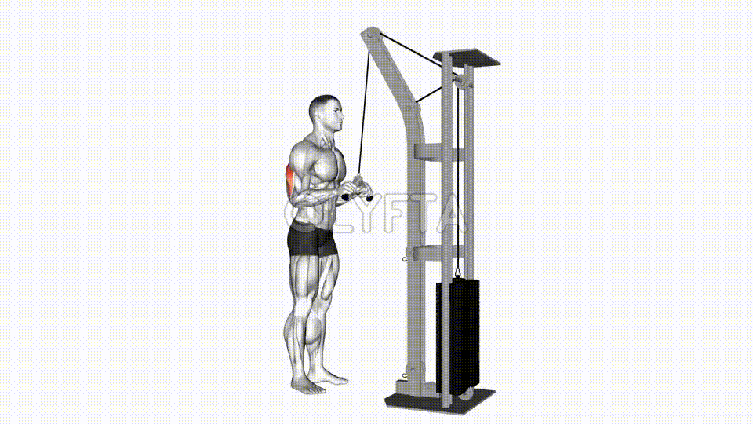

### 训练记录

- 2025 年 02 月 21 日，5kg
- 2025 年 02 月 23 日，5kg
- 2025 年 02 月 28 日，5kg
- 2025 年 07 月 03 日，5kg，4 组，每组 20 个
- 2025 年 08 月 24 日，20lb（9.07kg），4 组，每组 15 个

### 动作参考

- [https://lyfta.app/zh-CN/ex/6g5](https://lyfta.app/zh-CN/ex/6g5)

## 坐姿哑铃颈后臂屈 / Dumbbell Seated Triceps Extension

目的：重点锻炼肱三头肌长头，增强手臂后侧力量和肌肉体积，改善臂部线条和推力功能。

4 组，每组 12 到 20 个

- 坐在凳子上，腰部不要倚靠，肩膀倚靠后背
- 双手握住哑铃，右手在上，左手在下
- 把哑铃举过头，胳膊伸直（图中未伸直）
- 慢慢地将哑铃放到脑后，同时保持上臂不动，仅弯曲肘部直至呈 90 度角

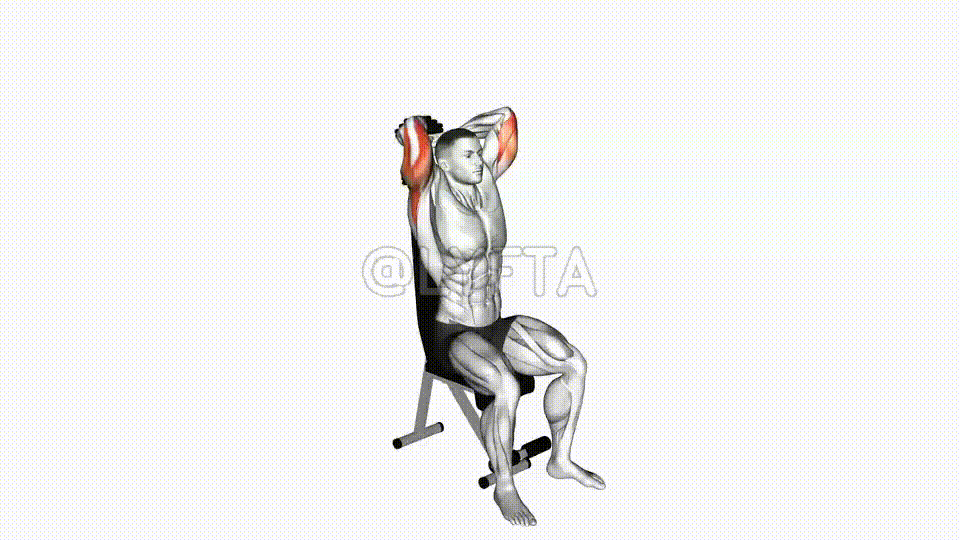

### 训练记录

- 2025 年 05 月 10 日，4 组，每组 15 个，5kg

### 动作参考

- [https://lyfta.app/zh-CN/ex/7sh](https://lyfta.app/zh-CN/ex/7sh)

# 背部 / Back

## 辅助引体向上 / Assisted Pull-up

目的：增强背阔肌、二头肌和肩部的力量与耐力

4 组，每组 12 到 20 个

- 一条腿先跪在板子上，然后双手握住把手，两手握住的长度要一致，然后另一个腿也跪上去板子
- 抬头沉肩
- 胳膊往里抵着，同时往上引，注意胸部和下巴要往抬着上引，整个人是直着往上引的
- 胳膊往里面抵着可以保证背部两侧的肌肉更被利用到，且也可以保证尽量不使用胳膊的力量
- 快拉慢回，控制住

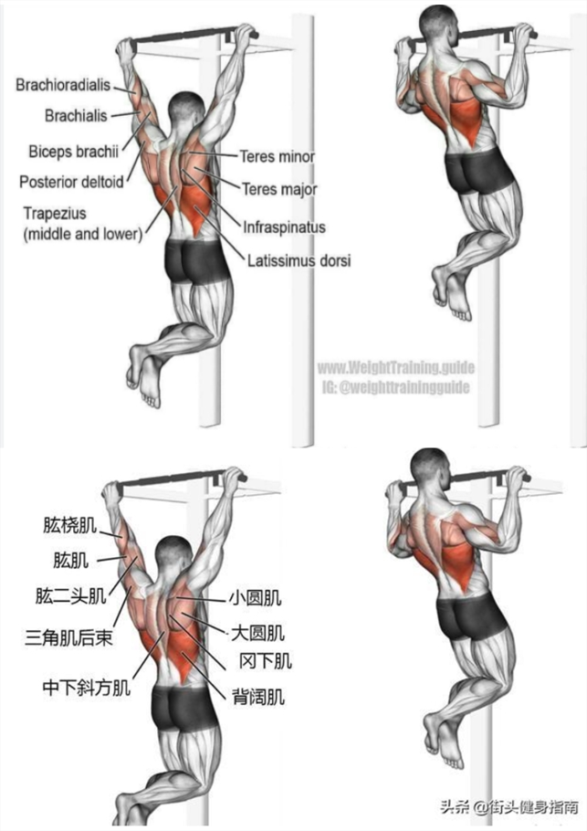

### 训练记录

- 最终重量要和体重一致
- 2025 年 03 月 06 日
- 2025 年 04 月 09 日，4 组，每组 15 个，54kg
- 2025 年 04 月 13 日，4 组，每组 15 个，54kg
- 2025 年 04 月 29 日，4 组，每组 15 个，54kg
- 2025 年 06 月 14 日，前 2 组 54kg，每组 18 个，后 2 组 49.5 kg 每组 8 个
- 2025 年 06 月 16 日，前 2 组 49.5kg 每组 12 个，后 2 组 54 kg，每组 20 个
- 2025 年 07 月 10 日，4 组，每组 15 个，45kg（该重量可能不准）
- 2025 年 08 月 24 日，4 组，前两组 7 挡位，每组 20 个，前两组 6 挡位，每组 15 个
- 2025 年 08 月 29 日，6 组，前两组 7 挡位，每组 20 个，前四组 6 挡位，每组 12 个

### 动作参考

- [https://www.lyfta.app/exercise/assisted-triceps-dip-69z](https://www.lyfta.app/exercise/assisted-triceps-dip-69z)

## 宽距高位下拉 / Cable Wide-Grip Lat Pulldown

目的：重点锻炼背阔肌的外侧和上部，增强背部宽度，改善背部线条和力量

4 组，每组 12 到 20 个

- 脚踩地蹬住，大腿前侧抵住柱子，可以踮脚尖
- 手掌朝前，宽握距正握杠铃，双手之间的距离比肩宽
- 稍微向后倾斜，保持腰背挺直
- 手肘往前伸，将杠铃向下拉至上胸部，同时将肩胛骨挤压在一起
- 在这个位置暂停片刻，保持背部肌肉的挤压
- 慢慢地将杠铃返回到起始位置，让手臂完全伸展，并感受到背阔肌的拉伸

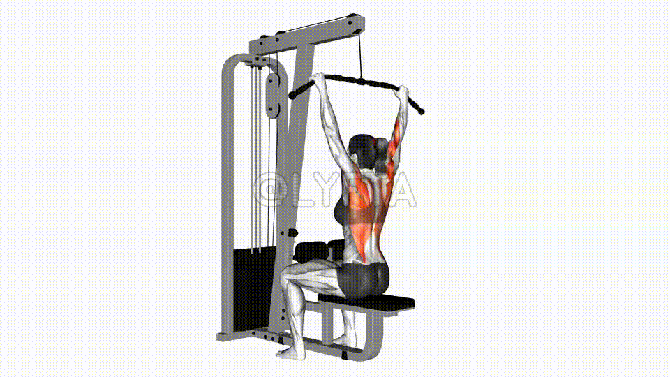

### 训练记录

- 2025 年 05 月 15 日，前 2 组 15kg- 15 个，后 2 组 20kg-12 个
- 2025 年 06 月 14 日，4 组，每组 15 个，15kg
- 2025 年 06 月 25 日，第 1 组，20kg，12 个，后 3 组，每组 15 个，15kg
- 2025 年 08 月 29 日，4组，前两组 15 个，20kg，后两组 20 个，13.5kg
- 2025 年 09 月 12 日，4 组-18.6kg-15 个

### 动作参考

- [https://lyfta.app/zh-CN/ex/7v7](https://lyfta.app/zh-CN/ex/7v7)

## 颈后高位下拉 / Grip Rear Pulldown Behind Neck

目的：强化背阔肌和肩胛骨稳定肌群，重点刺激背部上部和后肩，提高背部厚度和肩部稳定性

4 组，每组 12 到 20 个

- 脚踩地蹬住，大腿抵住柱子，可以踮脚尖
- 稍微往后坐，把上半身往前倾泄
- 双手正握杆，且握住的距离一直，双胳膊伸直
- 腰背挺直，头稍微往前伸，往下拉杆子直至肩背
- 下拉的时候注意控制，不要依靠惯性猛地往下拉

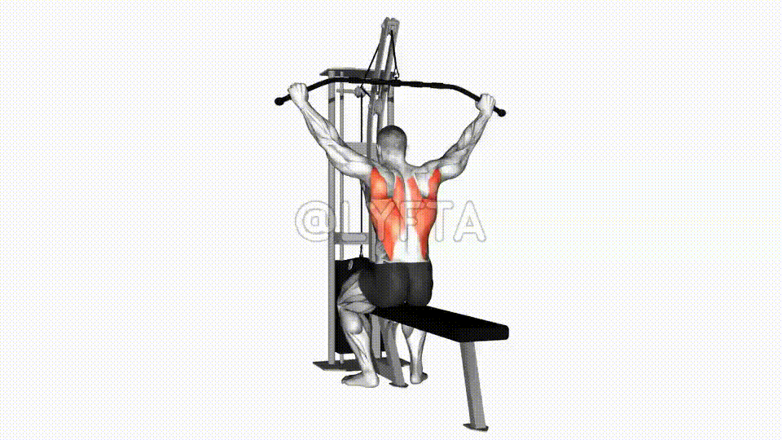

### 训练记录

- 2025 年 03 月 27 日，4 组，每组 15 个，15kg
- 2025 年 04 月 29 日，20kg
- 2025 年 06 月 25 日，第 1 组，20kg，12 个，后 3 组，每组 15 个，15kg
- 2025 年 07 月 02 日，4组，前两组 18 个，后两组 20 个，20kg
- 2025 年 08 月 24 日，4组，前两组 15 个，20kg，后两组 20 个，13.5kg

### 动作参考

- [https://www.lyfta.app/zh-CN/exercise/wide-grip-rear-pulldown-behind-neck-4j](https://www.lyfta.app/zh-CN/exercise/wide-grip-rear-pulldown-behind-neck-4j)

## 杠杆交叉背阔肌下拉 / Lever Cross Lat Pulldown

目的：重点锻炼背阔肌，尤其是背部外侧和中部肌群，提升背部宽度和厚度，同时增强肩胛骨的稳定控制能力

呼吸：拉下时呼气，回位时吸气

4 组，每组 12 到 20 个

- 调整座椅高度，不要太高或者太矮，大腿差不多水平于地面
- 双手正握手柄，握距与肩同宽
- 保持腰背挺直，胸部抬起，抬头，不要耸肩，避免身体过度后仰
- 收紧核心，稳定身体（身体后仰可能是核心没有收紧）
- 准备拉下重量，控制地拉下手柄，向上胸部方向拉近
- 动作底部时，注意感受肩胛骨向内挤压
- 缓慢将手柄放回起始位置
- 避免借助惯性，动作保持平稳连贯，在拉动和释放阶段都要控制重量，以最大化肌肉参与度
- 面朝器械的时候，注意胳膊肘部往前顶

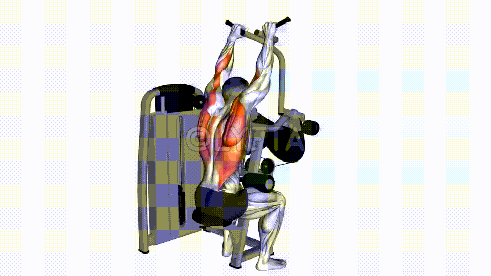
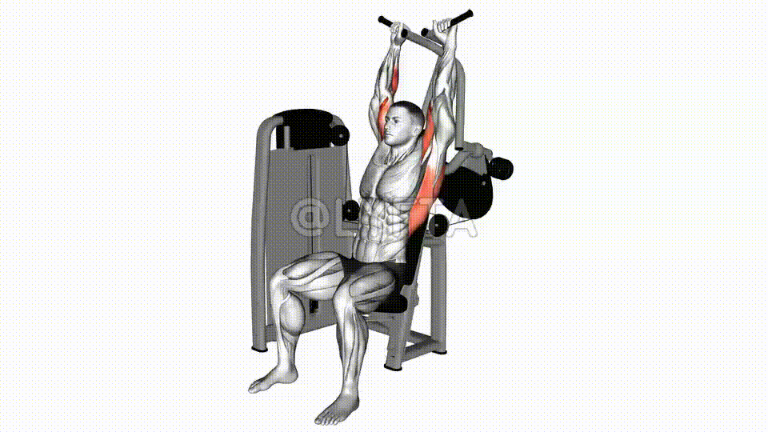

### 训练记录

- 2025 年 02 月 21 日，面朝器械
- 2025 年 02 月 23 日，面朝器械
- 2025 年 02 月 28 日，面朝器械
- 2025 年 03 月 14 日，背对器械
- 2025 年 03 月 21 日，背对器械
- 2025 年 03 月 29 日，背对器械，4 组，每组 15 个，17.5kg
- 2025 年 06 月 13 日，背对器械，4 组，每组 18 个，15kg
- 2025 年 06 月 18 日，背对器械，4 组，每组 18 个，17.5kg

### 动作参考

- [https://fitwill.app/zh-hans/exercise/6881/lever-cross-lat-pulldown/](https://fitwill.app/zh-hans/exercise/6881/lever-cross-lat-pulldown/)

## 单臂高位下拉 / (Cable) One Arm Lat Pulldown

目的：增强背阔肌单侧力量和平衡，促进肩胛骨的独立控制与稳定，提高背部肌肉的协调性和对称性

每一侧 4 组，每组 12 到 20 个

- 单手拉器械，握住把手最远的位置，往下拉的时候，手肘往前伸
- 注意要保证运动轨迹最长，即还原到手臂可以举到的最高点，然后再往下拉器械
- 从上往下拉的时候可以用另外一只手摸着背外侧的肌肉，感受肌肉发力，这样还可以更好的保持身体稳定不晃动
- 身体不要僵，可以适当侧倾身体

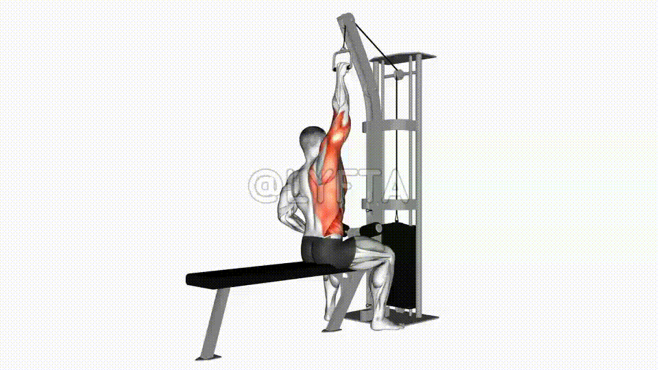

### 训练记录

- 2025 年 04 月 17 日，每侧 3 组，每侧 17.5kg/2，每组 15 个
- 2025 年 06 月 16 日，每侧 4 组，每侧 17.5kg/2，每组 12 个
- 2025 年 06 月 25 日，每侧 4 组，每侧 17.5kg/2，每组 18 个
- 2025 年 07 月 10 日，每侧 4 组，每侧 10 kg，每组 15 个
- 2025 年 09 月 12 日，每侧 2 组，每侧 14 kg，每组 15 个

### 动作参考

- [https://lyfta.app/zh-CN/ex/75z](https://lyfta.app/zh-CN/ex/75z)

## 坐姿划船 / Low Seated Row

目的：锻炼背部中部肌群，特别是菱形肌和斜方肌中下部，增强肩胛骨收缩与稳定，改善姿势和上背力量

4 组，每组 12 到 20 个

- 双脚抵住，往后坐住，双手正握/双手放在杆子上，大拇指抵住杆子的两端
- 胳膊伸直，抬头沉肩
- 向后夹背的同时挺胸腔，肩向两侧延展，向后拉伸，拉的时候注意找夹背的感觉
- 把杆子往肚子往上一点点的位置拉
- 快拉慢放

窄距坐姿划船
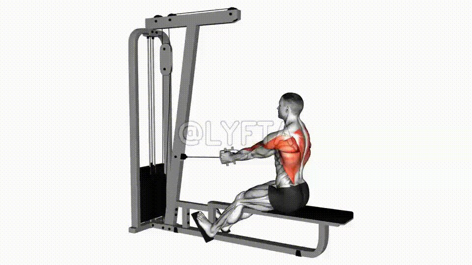

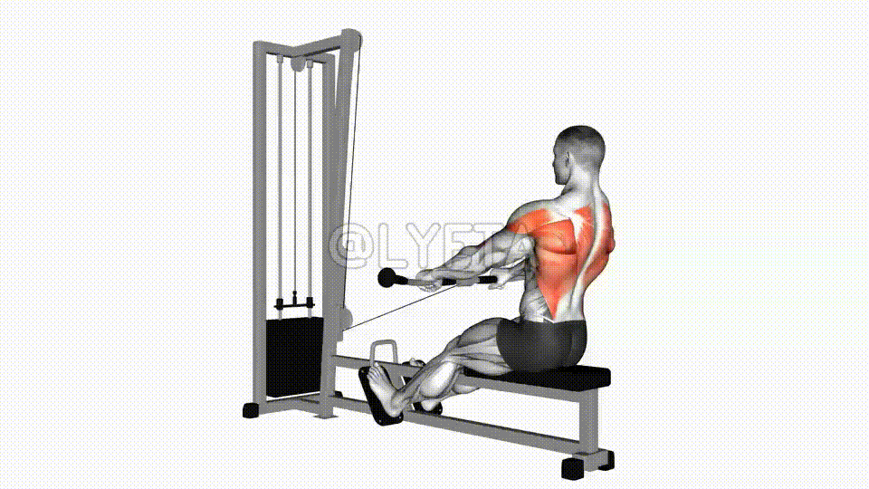

宽距坐姿划船
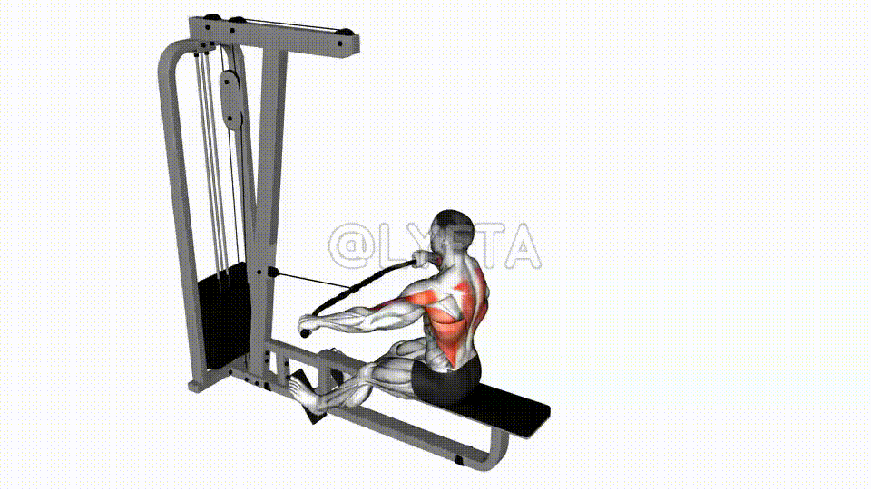

### 训练记录

- 2025 年 03 月 09 日
- 2025 年 03 月 14 日
- 2025 年 03 月 21 日
- 2025 年 03 月 27 日，4 组，每组 15 个，重量忘记了
- 2025 年 04 月 13 日，4 组，每组 15 个
- 2025 年 04 月 29 日
- 2025 年 06 月 07 日，窄距坐姿划船，4 组，前两组每组 18 个，17.5kg；后两组每组 12 个，20kg

### 动作参考

- [https://lyfta.app/zh-CN/ex/79](https://lyfta.app/zh-CN/ex/79)
- [https://lyfta.app/zh-CN/ex/7c](https://lyfta.app/zh-CN/ex/7c)

## T 杆划船 / Lever T-bar Row

目的：强化背部中部和下部肌群，特别是菱形肌、斜方肌和背阔肌，提升背部厚度与力量，改善肩胛骨稳定性和姿势控制

4 组，每组 12 到 20 个

- 双手正握双杆
- 胳膊伸直，收紧腹部（吸紧肚子），整个过程都要腰背挺直
- 屈髋（有点像后撅屁股），同时注意腰背挺直
- 自然抬头向前看，不要向前伸头
- 拉住杆子向上抬起然后放下

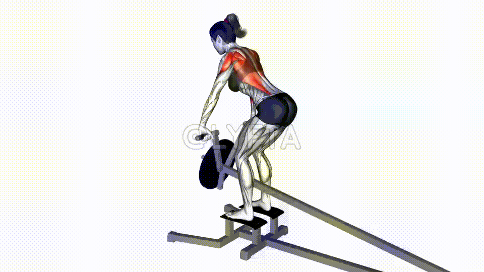

### 训练记录

- 2025 年 03 月 24 日，没加重量片

### 动作参考

- [https://lyfta.app/zh-CN/ex/81o](https://lyfta.app/zh-CN/ex/81o)

## 罗马椅伸展 / Roman Chair Extension

细节忘记了

### 训练记录

- 2025 年 02 月 23 日

## 单臂哑铃划船 / One Arm Bent-over Row

目的：强化背阔肌、菱形肌和斜方肌，同时锻炼核心稳定性，促进身体左右侧力量平衡与协调

每侧 4 组，每组 12 到 20 个

- 左侧膝盖跪在长凳上，大腿与长凳垂直，右侧脚面与左侧膝盖处于同一水平面上
- 左侧手掌撑在长凳上，左侧胳膊与长凳以及肩膀垂直
- 上述三点形成三角稳定结构
- 保持背部平坦并与地板平行
- 右手握住哑铃，自然向下垂直，但是不要往下低身体，保证肩膀与地面平行
- 借助背部力量将哑铃向上拉至躯干侧面，上臂靠近身体侧面，然后往上转，但是躯干不要往上拱起来，过程中要保持躯干静止
- 然后将哑铃慢放回起始位置

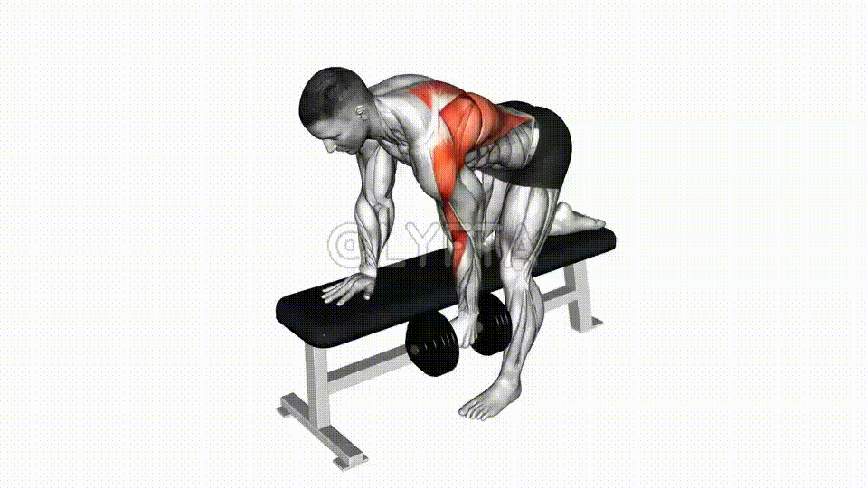

### 训练记录

- 2025 年 03 月 14 日
- 2025 年 06 月 27 日，3 kg，每侧 3 组，每组 12 个
- 2025 年 07 月 25 日，2 kg，每侧 4 组，每组 15 个

### 动作参考

- [https://lyfta.app/zh-CN/ex/8h](https://lyfta.app/zh-CN/ex/8h)

## 直臂下压 / Cable Straight Arm Pulldown

目的：主要针对背部肌肉，尤其是背阔肌，同时也锻炼肩膀和核心肌群

4 组，每组 12 到 20 个

- 身体稍远离滑轮站立，双脚与肩同宽，微屈膝、挺胸收腹，保持腰背稳定
- 起始时身体略微前倾，背部收紧，不要耸肩，目光向下
- 用手掌向下按压横杆（而非紧握），双手间距略宽于肩，减少手臂代偿
- 放松手臂，让滑轮带动手臂自然伸直，感受背部拉伸
- 向下拉至大腿前，肩膀向后展，动作底部挤压背阔肌，顺势抬头
- 快压慢回：控制回程，避免惯性，维持肌肉张力
- 向下拉压时呼气（发力阶段），控制回放时吸气（放松阶段）

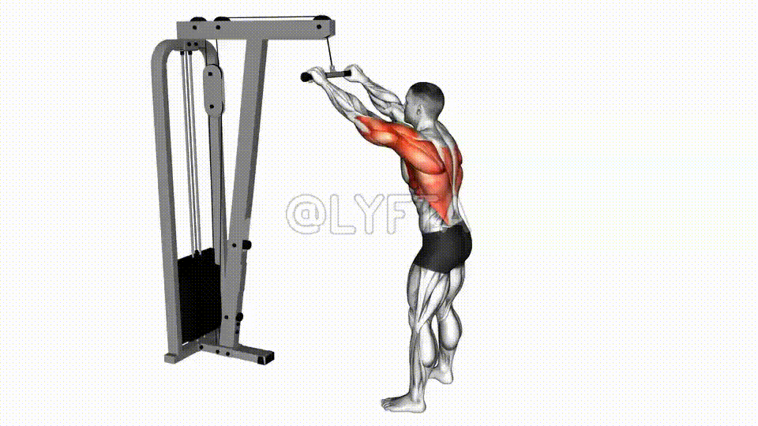

### 训练记录

- 2025 年 05 月 18 日，4 组，每组 12 个，5kg

### 动作参考

- [https://lyfta.app/zh-CN/ex/6fc](https://lyfta.app/zh-CN/ex/6fc)

# 胸部 / Chest

## 杠铃卧推 / Barbell Bench Press

目的：主要针对胸部肌肉，同时也锻炼肩膀和三头肌

4 组，每组 12 到 20 个

- 平躺在卧推凳上，双手握杠，握距略宽于肩，确保前臂垂直地面
- 手掌正握，保持手腕中立，不歪斜，让手掌竖着朝向地面
- 初始位置将杠铃置于上胸上方
- 向上推起杠铃，伸直手臂，但不过度锁肘
- 控制下放节奏：快推慢放，增加肌肉张力
- 推起杠铃时呼气（发力时呼气，更有力），下放杠铃时吸气（胸腔扩张，增强稳定性）

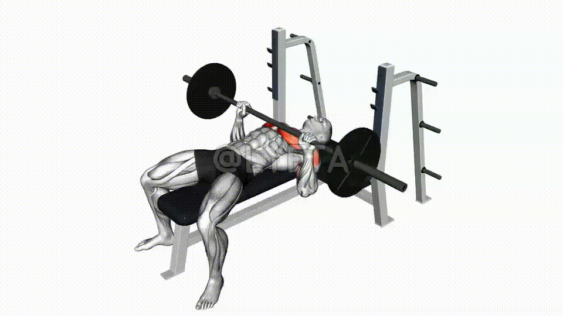

### 训练记录

- 2025 年 05 月 18 日，4 组，每组 12 个，10kg（但有教练辅助，自己举不动这个重量）

### 动作参考

- [https://lyfta.app/zh-CN/ex/605](https://lyfta.app/zh-CN/ex/605)

# 腹部 / Waist

## 前平板支撑 / Front Plank

目的：强化核心肌群，包括腹直肌、腹横肌和斜肌，同时提升肩部、背部和臀部的稳定性，改善整体体态和身体控制能力

- 下面动图图中的动作有点不对，注意不要撅屁股，而是把腰部往上拱起来，这样才会练到腹部且腰不累
- 呼气的时候收肚子，吸气的时候保持不动

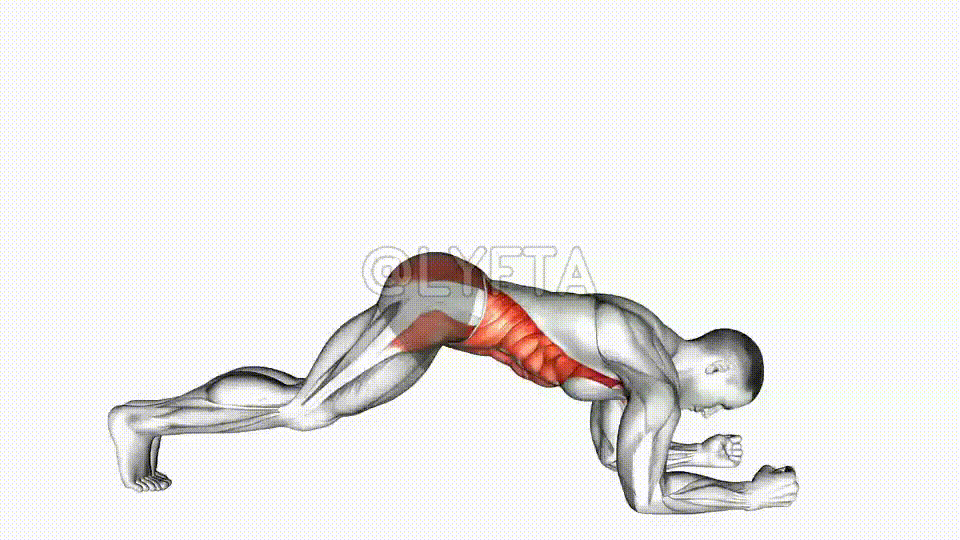

### 训练记录

- 2025 年 05 月 10 日，3 组，每组 40 秒
- 2025 年 05 月 15 日，2 组，每组 60 秒

### 动作参考

- [https://lyfta.app/zh-CN/ex/6m1](https://lyfta.app/zh-CN/ex/6m1)

## 船长椅直腿抬高/ Captains Chair Straight Leg Raise

目的：强化腹直肌和下腹部肌群，提升核心力量和稳定性，有助于改善体态和增强躯干控制

4 组，每组 12 到 20 个

- 确保双腿笔直下垂且脚不接触地面
- 深吸气，呼气时，慢慢地将双腿伸直，直到与地板平行，保持膝盖和背部伸直
- 保持这个姿势几秒钟
- 吸气时慢慢将双腿放回到悬挂位置，确保保持控制，不要让双腿摆动或使用动力

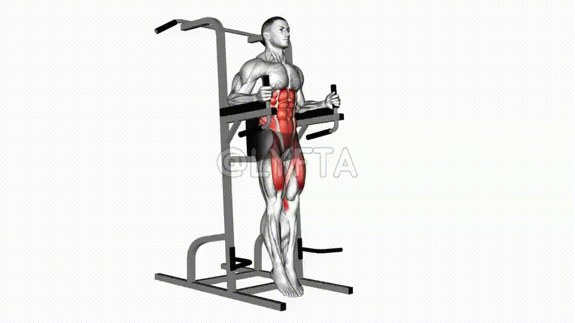

### 训练记录

- 2025 年 02 月 28 日

### 动作参考

- [https://lyfta.app/zh-CN/ex/83u](https://lyfta.app/zh-CN/ex/83u)
- [悬挂抬腿练腹肌](https://www.jianshen8.com/jirou/fubu/16570.html)

## 俄罗斯转体 / Russian Twist

目的：强化腹部斜肌和核心旋转控制能力，提升躯干的稳定性与灵活性，有助于改善运动中的旋转动作和整体核心力量

4 组，每组 12 到 20 个

- 双手放在身前，或者手指交握，也可以拿着哑铃等有重量的东西
- 双脚可以找个地方压住，转的时候腿部要发力，帮助稳定身体
- 保持背部挺直，将躯干向右扭转，然后向左扭转，完成一次动作
- 注意，是腹部转，不是胳膊转，扭转时也要稳定住臀部，避免臀部有过大的移动幅度
- 将腹肌拉向脊柱，然后稍微向后倾斜，直到感觉腹肌处于平衡位置

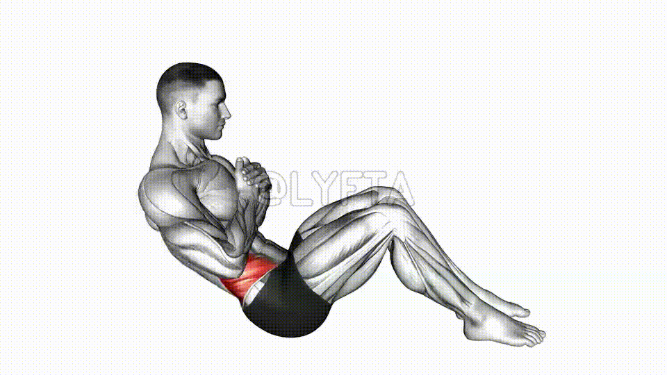

### 训练记录

- 2025 年 03 月 21 日，无负重
- 2025 年 06 月 13 日，无负重

### 动作参考

- [https://lyfta.app/zh-CN/ex/6sj](https://lyfta.app/zh-CN/ex/6sj)
- [https://lyfta.app/zh-CN/ex/76t](https://lyfta.app/zh-CN/ex/76t)

## V 型仰卧起坐 / V-Up

目的：强化腹直肌和髋屈肌，提升核心力量和身体协调性，增强躯干稳定与控制能力

4 组，每组 8 到 20 个

- 启动腹部肌肉，同时将双腿和上半身抬离地面，双手呈“V”形伸向双脚。
- 保持这个姿势几秒钟，保持双腿和手臂尽可能伸直。
- 慢慢地将身体放回起始位置，确保保持控制，不要让身体简单地落回地板上。

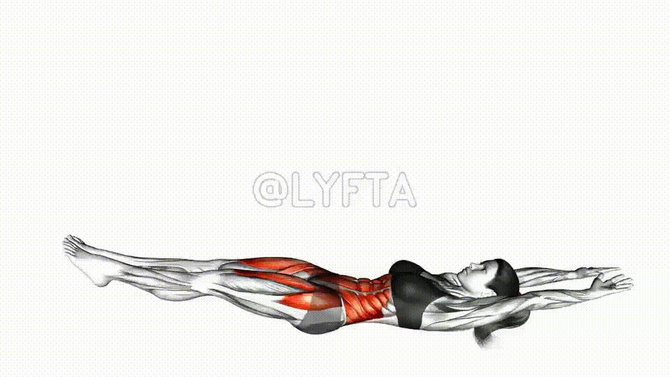

### 训练记录

- 2025 年 03 月 09 日

### 动作参考

- [https://lyfta.app/zh-CN/ex/6w3](https://lyfta.app/zh-CN/ex/6w3)

## 负重上举/ 负重卷腹 / Weighted Sit-Up / Weighted Crunch

目的：增加腹直肌和核心肌群的力量与耐力，通过负重提升训练强度，促进腹部肌肉的增长和功能提升

4 组，每组 12 到 20 个

- 初始状态是躺在器械上，肩膀贴住器械，双脚钩住器械的卷轴
- 呼气起身向上举，注意胳膊要往上举到无法再往上了，胳膊要伸直
- 吸气往回收，回收到腰部贴住器械即可，肩膀不需要再贴住器械了，然后再次循环上举

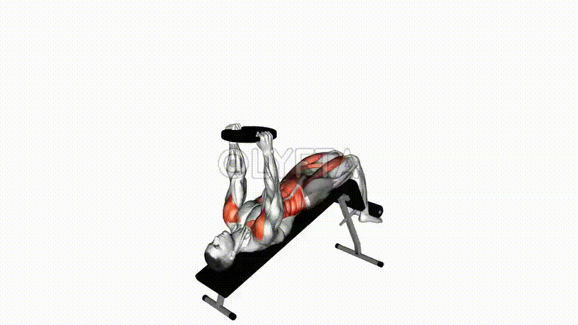

### 训练记录

- 2025 年 03 月 21 日
- 2025 年 06 月 13 日，3 组，每组 12 个，2kg
- 2025 年 06 月 21 日，3 组，每组 20 个，3kg

### 动作参考

- [https://lyfta.app/zh-CN/ex/8x9](https://lyfta.app/zh-CN/ex/8x9)

## 仰卧抬腿 / Lying Leg Raise

目的：主要锻炼腹直肌下部和髋屈肌，增强核心力量和下腹部控制，改善躯干稳定性

4 组，每组 12 到 20 个

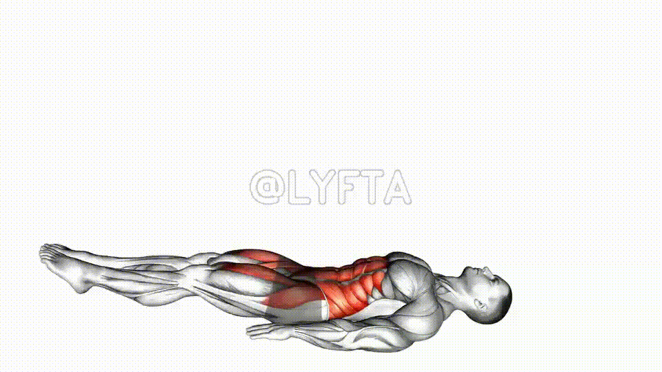

### 训练记录

- 2025 年 03 月 21 日

### 动作参考

- [https://lyfta.app/zh-CN/ex/755](https://lyfta.app/zh-CN/ex/755)

## 罗马椅负重侧腹 / Weighted Side Bends on Roman Chair

目的：强化侧腹肌群（腹外斜肌、腹内斜肌），有助于增强躯干的旋转和侧屈能力

4 组，每组 12 到 20 个

- 如果咯得上可以垫一个瑜伽垫
- 侧身双脚站在脚蹬上，下面的腿靠住器械/瑜伽垫，上面的腿（小腿）靠住脚蹬处，站稳
- 一只手握住哑铃，往下伸胳膊，同时头和上半身躯干也跟着往下伸；另一只手叉腰放，可以感受到该侧的侧腹肌肉随着另一侧胳膊往下伸的时候有在拉长，然后往上起身，整个过程动作要流畅，不要一卡一卡的
- 注意整个过程中，要去感受侧腹部肌肉被拉伸
- 注意上半身以及头不要往前，想象后面有一堵墙需要靠住

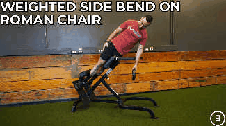

### 训练记录

- 2025 年 03 月 24 日
- 2025 年 06 月 07 日，8 组，每一侧 4 组，每组 12 个，2.5kg
- 2025 年 06 月 07 日，2 组，每一侧 1 组，每组 10 个，2.5kg

# 臀腿

## 概述

- 髋部 / Hips：包含多种结构，不只是肌肉
	- 臀肌 / Glutes
	- 髋关节
	- 髋屈肌群（如髂腰肌 / Iliopsoas）
	- 关节囊、韧带、股骨头周围软组织
- 臀肌 / Glutes
	- 臀大肌 / Gluteus Maximus：主要负责髋部伸展、外旋
	- 臀中肌 / Gluteus Medius：负责髋外展、稳定骨盆
	- 臀小肌 / Gluteus Minimus：深层肌，协助臀中肌进行外展与稳定
- 大腿肌肉 / Thighs
	- 股四头肌或者大腿前侧 / Quadriceps：伸展膝盖，如深蹲起身、腿举等动作
	- 股二头肌群或者大腿后侧 / Hamstrings：屈膝、伸髋，如硬拉、腿弯举
	- 大腿内侧 / Adductors：大腿内收，如内收机、相扑深蹲等
	- 大腿外侧 / Abductors：大腿外展，如侧抬腿、弹力带走路
- 小腿肌肉
	- 小腿前侧 / Tibialis Anterior：背屈脚踝（脚尖向上），控制落地缓冲
	- 小腿后侧 / Calves
		- 腓肠肌 / Gastrocnemius：参与爆发力动作（跳跃）
		- 比目鱼肌 / Soleus：负责耐力、站立稳定

| 部位        | 英文                 | chatGPT 推荐的训练动作                                       | 器械 / 方式                |
| ------------------ | ---------------------- | ------------------------------------------------------------ | -------------------------- |
| 臀大肌       | Gluteus Maximus        | - 臀桥（Hip Thrust）  - 罗马尼亚硬拉（Romanian Deadlift）- 弓步蹲（Lunges） | 壶铃、杠铃、杠铃垫         |
| 臀中/小肌    | Gluteus Medius/Minimus | - 側抬腿（Side-Lying Leg Raise）- 怪兽走（Monster Walk）- 弹力带外展 | 弹力带、徒手               |
| 髋屈肌       | Hip Flexors            | - 抬腿（Leg Raise）- 高抬腿跑（High Knees）                  | 徒手、拉力器               |
| 股四头肌     | Quadriceps             | - 深蹲（Squat）- 腿举（Leg Press）- 坐姿腿伸展（Leg Extension） | 史密斯机、腿举机、固定器械 |
| 股二头肌群   | Hamstrings             | - 罗马尼亚硬拉（RDL）- 俯身腿弯举（Lying Leg Curl）          | 杠铃、腿弯举机             |
| 大腿内侧肌   | Adductors              | - 相扑深蹲（Sumo Squat）- 内收训练器（Adductor Machine）     | 史密斯机、内收机           |
| 大腿外侧肌   | Abductors              | - 弹力带外展、侧抬腿- 外展训练器（Abductor Machine）         | 弹力带、外展机             |
| 小腿后侧肌群 | Calves                 | - 踮脚提踵（Standing/Sitting Calf Raise）- 跳绳              | 自重、提踵机、哑铃         |
| 小腿前侧肌肉 | Tibialis Anterior      | - 脚尖上提训练（Toe Raises）- 负重背屈练习                   | 徒手、脚背拉力器           |

## 深蹲 / Squat

目的：强化下肢肌群，尤其是股四头肌、臀大肌和腘绳肌，同时增强核心稳定性和整体力量，提高功能性运动表现

2 组，每组 15 个

- 双手合十对掌
- 双脚打开，肩部的 1.5 倍宽，脚尖朝外
- 往后屈髋，下蹲至大腿与地面平行即可，保证膝盖不要超过脚尖
- 向上起的时候，双脚用力，否则膝盖会晃动，同时也要保证腰背挺直

### 训练记录

- 2025 年 04 月 13 日，2 组，每组 15 个
- 2025 年 04 月 29 日，2 组，每组 15 个

## 高脚杯深蹲 / Goblet Squat

目的：锻炼下肢肌群（股四头肌、臀大肌、腘绳肌），增强核心稳定性，同时帮助改善深蹲姿势和活动范围，适合初学者及技术调整

4 组，每组 12 到 20 个

- 双脚距离是肩部的 1.5 倍宽度，两脚稍微往外打开
- 双手托住哑铃一侧，小臂夹住哑铃另外一侧
- 向下蹲的时候，注意先屈髋，然后下蹲，下蹲到臀部不眨眼位置
- 双脚使劲往上起，保证膝盖稳定不晃动，注意要慢起身，即快远心、慢离心

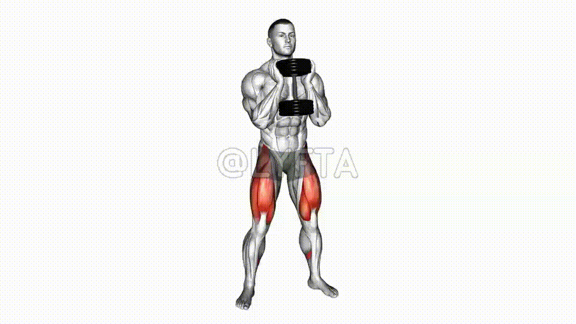

### 训练记录

- 2025 年 04 月 17 日，5kg，4 组，每组 12 个
- 2025 年 07 月 25 日，2 kg，4 组，每组 15 个

### 动作参考

- [https://lyfta.app/zh-CN/ex/ge](https://lyfta.app/zh-CN/ex/ge)

## 史密斯相扑深蹲 / Smith Sumo Squat

目的：重点锻炼内收肌群、臀大肌和股四头肌，增强下肢力量和稳定性，同时通过宽站姿改善髋关节灵活性和臀部激活

4 组，每组 12 到 20 个

- 双手握住横杆，长度一致
- 单腿进入横杆下面，然后把横杆放置在斜方肌上（注意，不是脖子，是略微靠后一点的位置）
- 起身解锁横杆，然后另一只腿也进入横杆下面
- 前后、左右调整双脚：前后（最终位置要让杠铃的稳定的被放置在身体上，不要太靠前，否则肚子会往前鼓着，也不要太往后），左右（双脚站立的宽度为 1.5 倍肩宽，脚尖略微朝外）
- **髋膝踝**联动：屈髋、屈膝、下蹲，注意不可以先屈髋或先屈膝
- **膝盖**：下蹲的时候，膝盖不要往外打开，自然朝向脚尖即可，也不要超过脚尖（超过了脚尖说明屈髋没有到位）
- **下蹲到大腿和地面平行**，臀部不眨眼
- **双脚用力蹬地起身**
- **整个过程腰要挺直**！
- 动作流畅，不要做太快

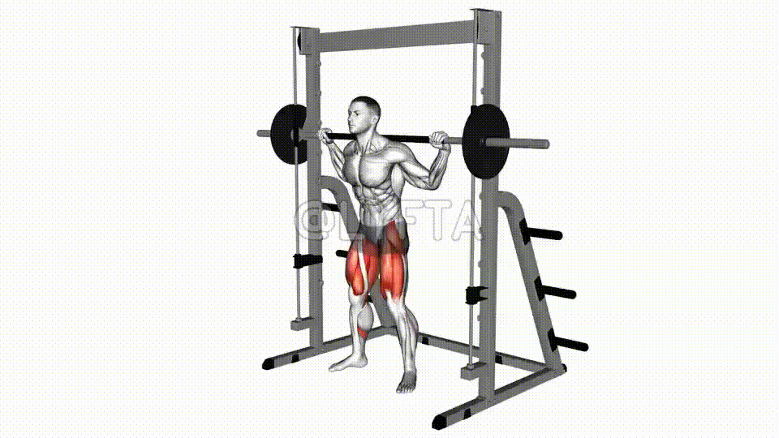

### 训练记录

- 2025 年 05 月 10 日，4 组，每组 15 个，5kg*2
- 2025 年 06 月 18 日，1 组不加重量热身，4 组，每组 15 个，5kg*2
- 2025 年 06 月 21 日，4 组，每组 15 个，5kg*2
- 2025 年 06 月 27 日，4 组，每组 15 个，5kg*2
- 2025 年 07 月 02 日，4 组，每组 15 个，5kg*2
- 2025 年 07 月 10 日，4 组，每组 15 个，5kg*2

### 动作参考

- [https://lyfta.app/zh-CN/ex/8it](https://lyfta.app/zh-CN/ex/8it)

## 反向哈克机深蹲 / Lever Reverse Vertical Hack Squat

目的：重点锻炼股四头肌、臀大肌和腘绳肌，增强下肢力量与爆发力，同时减少脊柱负担，适合康复训练及力量提升

4 组，每组 12 到 20 个

- 肩膀靠在肩垫上，手扶住两侧的把手，同时一只脚站上去，然后另外一只脚再站上去
- 双肩抵住器材，撑起来，腰背挺直，核心收紧
- 调整双脚位置，双脚距离与髋部同宽（或者 1.5 倍肩宽），脚尖朝外
- 向下蹲的同时向后屈髋，核心收紧（肚脐找向后背），保持腰背是直的，也不要低头
- 不需要蹲到太深，大腿和地面平行即可，膝盖不要锁死，膝盖不要内扣，膝盖不要超出脚尖！
- 向上起的时候，双脚用力，否则膝盖会晃动，同时也要保证腰背挺直
- 注意要慢起身，即快远心、慢离心
- 做完要注意脚踩器材前面的踏板，把器材锁住再下来

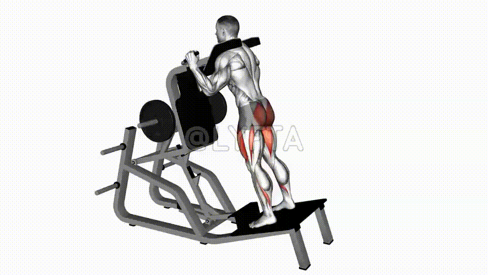

### 训练记录
- 2025 年 03 月 29 日，4 组，每组 8 个，5kg* 2
- 2025 年 04 月 29 日，4 组，每组 8 个，5kg * 2
- 2025 年 05 月 15 日，4 组，每组 12 个，5kg * 2
- 2025 年 06 月 13 日，4 组，每组 12 个，10kg * 2

## 史密斯硬拉 / Smith Deadlift

目的：强化下背部、臀大肌、腘绳肌和股四头肌，提升整体后链力量和稳定性，同时借助史密斯机的轨迹控制，降低动作难度和受伤风险

4 组，每组 12 到 20 个

- 双手放在杆子上，与肩膀同宽，脚尖朝外
- 下蹲，小腿和地面垂直，保持腰背挺直
- 双手往上提起来杆子，注意手臂不要用力，往上提的同时把力量往臀部传导，臀部收紧

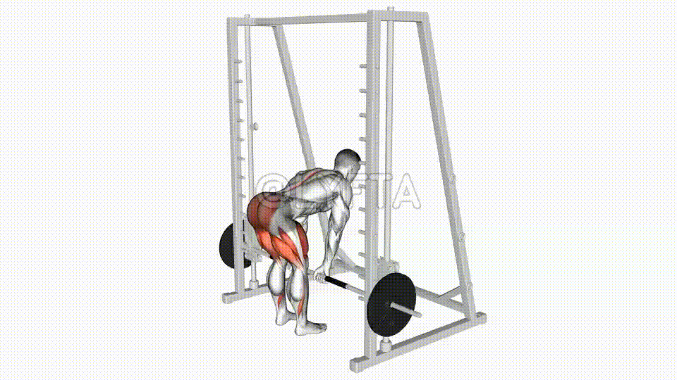

### 训练记录

- 2025 年 04 月 05 日，4 组，5kg * 2

### 动作参考

- [https://www.lyfta.app/zh-CN/exercise/smith-deadlift-1x](https://www.lyfta.app/zh-CN/exercise/smith-deadlift-1x)

## 坐姿腿屈伸 / Lever Leg Extension

目的：重点锻炼股四头肌，增强膝关节伸展力量，有助于膝关节稳定和下肢功能改善

4 组，每组 12 到 20 个

- 可以倚靠在靠背上，但是不要驼背，双手可以放在座位旁边的把手上
- 双腿自然打开，双膝盖平直放置，膝盖朝前
- 快抬慢放：抬腿至水平于地面，然后控制住慢慢放下来，放到三分之二即可

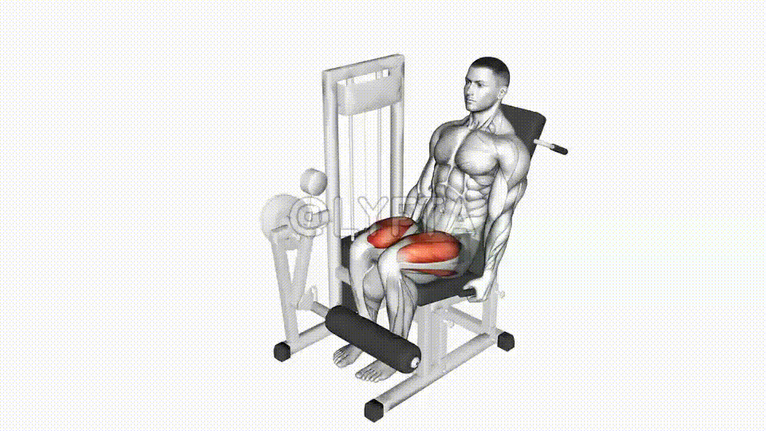

### 训练记录

- 2025 年 02 月 23 日
- 2025 年 03 月 27 日，每组 15 个，17.5kg
- 2025 年 06 月 07 日，4 组，前两组每组 15 个，17.5kg；后两组每组 15 个，15kg
- 2025 年 06 月 21 日，4 组，前两组每组 12 个，17.5kg；后两组每组 15 个，15kg
- 2025 年 06 月 27 日，4 组，第一组 8 个，17.5kg；后三组每组 15 个，15kg
- 2025 年 09 月 12 日，4 组，3 组-16kg-15 个，1 组-16kg-18 个

### 动作参考

- [https://www.lyfta.app/zh-CN/exercise/lever-leg-extension-0b](https://www.lyfta.app/zh-CN/exercise/lever-leg-extension-0b)

## 坐姿腿弯举 / Lever Seated Leg Curl

目的：强化腘绳肌群（大腿后侧肌肉），提升膝关节屈曲力量，有助于膝关节稳定和下肢协调控制

4 组，每组 12 到 20 个

- 可以倚靠在靠背上，但是不要驼背，双手可以放在座位旁边的把手上
- 双腿自然打开，双膝盖平直放置，膝盖朝前
- 快压慢放：往里面收腿，注意一定要收到底，稍停顿一会，然后控制住慢慢抬起来，抬的位置不要太高，略微和地面有点锐角就行，或者说抬到三分之二即可

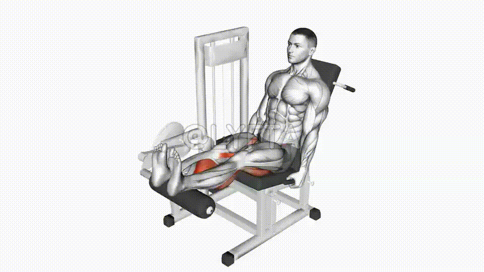

### 训练记录

- 2025 年 04 月 13 日，4 组，每组 15 个，17.5kg
- 2025 年 04 月 17 日，4 组，每组 15 个，17.5kg
- 2025 年 04 月 29 日，4 组，每组 15 个，20kg
- 2025 年 05 月 15 日，4 组，每组 15 个，20kg
- 2025 年 06 月 21 日，4 组，每组 15 个，17.5kg
- 2025 年 06 月 27 日，4 组，每组 15 个，17.5kg

### 动作参考

- [https://www.lyfta.app/zh-CN/exercise/lever-seated-leg-curl-11](https://www.lyfta.app/zh-CN/exercise/lever-seated-leg-curl-11)

## 器械倒蹬 / Lever Seated Leg Press

目的：锻炼股四头肌、臀大肌和腘绳肌，增强下肢整体力量与爆发力，同时通过坐姿支撑减轻腰椎压力，适合力量训练和康复训练

4 组，每组 12 到 20 个

- 双脚踩在板子上，双脚打开，脚后跟与比肩略宽，脚尖稍微朝外一点
- 膝盖与脚尖处于同一条线上
- 双手可以放在大腿或者两边器材上
- 用力蹬的时候，用脚后跟发力，脚尖不要发力，这样可以保证膝盖稳定，一直推到器械直到膝盖不锁死的状态，即腿不完全蹬直，保持微屈
- 中间不要停，立刻回收，但是回收的时候要慢，即快推慢回
- 往回收的时候，膝盖不要乱晃，既不要内扣，也不要往外展开，要和脚尖处于同一线，回的话要收到最初始状态

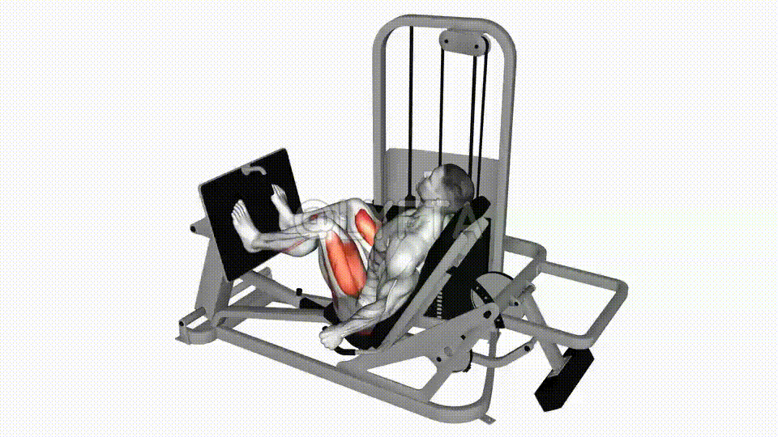
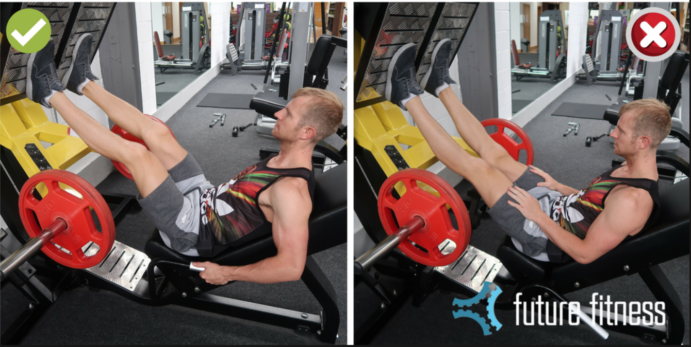

### 训练记录

- 2025 年 03 月 24 日
- 2025 年 04 月 05 日，4 组，每组 15 个，40kg
- 2025 年 04 月 13 日，前 2 组 40kg 每组 12 个，后 2 组 30 kg，每组 15 个
- 2025 年 06 月 16 日，前 2 组 30kg 每组 15 个，后 2 组 40 kg，每组 15 个
- 2025 年 06 月 29 日，4 组，每组 15 个，40kg

### 动作参考

- [https://www.lyfta.app/zh-CN/exercise/lever-seated-leg-press-7uk](https://www.lyfta.app/zh-CN/exercise/lever-seated-leg-press-7uk)

## 坐姿髋外展 / Lever Seated Hip Abduction

目的：强化臀中肌和臀小肌，提升髋关节外展力量与稳定性，改善骨盆控制和预防下肢损伤

4 组，每组 12 到 20 个

- 脚跟要踩稳，膝盖与小黑块平齐
- 背部保持挺直，不要倚靠也不要驼背，头不要前伸（与图中略不同）
- 快速向外打开，缓慢向内收，控制器械慢回
- 每一组的最后一个也可以保持向外打开的状态十秒，或者每一组最后一个，不要完全回去，保持小幅度收放

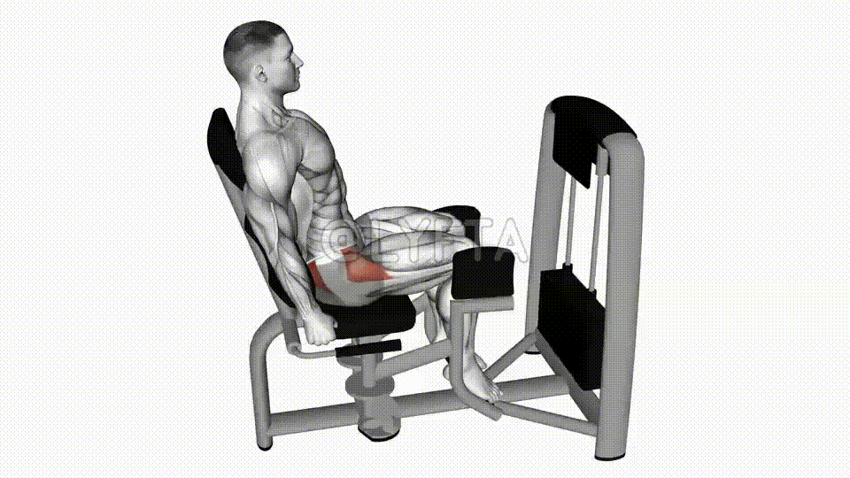

### 训练记录

- 2025 年 02 月 28 日
- 2025 年 03 月 24 日
- 2025 年 03 月 27 日，4 组，每组 15 个，20kg
- 2025 年 04 月 05 日，4 组，每组 15 个
- 2025 年 06 月 29 日，4 组，每组 15 个大幅度摆动 + 15 个小幅度摆动 + 5 秒不回放回，20kg
- 2025 年 07 月 10 日，4 组，每组 15 个大幅度摆动 + 15 个小幅度摆动 + 5 秒不回放回，26kg（该重量可能不准）

### 动作参考

- [https://www.lyfta.app/zh-CN/exercise/lever-seated-hip-abduction-19](https://www.lyfta.app/zh-CN/exercise/lever-seated-hip-abduction-19)

## 坐姿髋内收 / Lever Seated Hip Adduction

目的：强化大腿内收肌群，提升髋关节内收力量与稳定性，改善骨盆控制，促进下肢协调与平衡

4 组，每组 12 到 20 个

要点同 坐姿髋外展

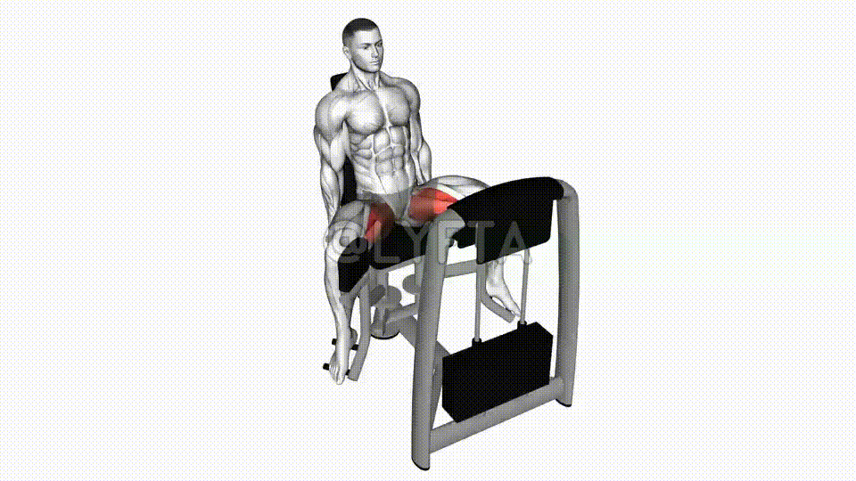

### 训练记录

- 2025 年 02 月 28 日
- 2025 年 04 月 05 日，20kg
- 2025 年 08 月 29 日，4 组，每组 20 个，20kg
- 2025 年 09 月 12 日，6 组，1 组-20kg-20 个，1 组-23kg-20 个，2 组-25kg-20 个，2 组-27kg-15 个

### 动作参考

- [https://www.lyfta.app/zh-CN/exercise/lever-seated-hip-adduction--8vn](https://www.lyfta.app/zh-CN/exercise/lever-seated-hip-adduction--8vn)

## 哑铃保加利亚分腿深蹲 / Dumbbell Bulgarian Split Squat

目的：强化股四头肌、臀大肌和腘绳肌，提升单侧下肢力量与稳定性，增强核心控制，改善身体平衡和运动协调性

每侧各 4 组，每组 12 到 20 个

- 先坐着，把左腿伸直，然后起身站起来，左脚就放在原本坐着的左腿位置
- 右腿搭在后面座椅上，注意只是搭着就可以，不要完全把右腿放在座椅上
- 左手放在左臀，右手拿着哑铃
- 保持腰背挺直，右胳膊放在左脚的前侧，然后往下放，身体往下压，但是注意左腿的膝盖不要往前弓，要往后送左臀，动作幅度大一些
- 然后反过来做另外的腿

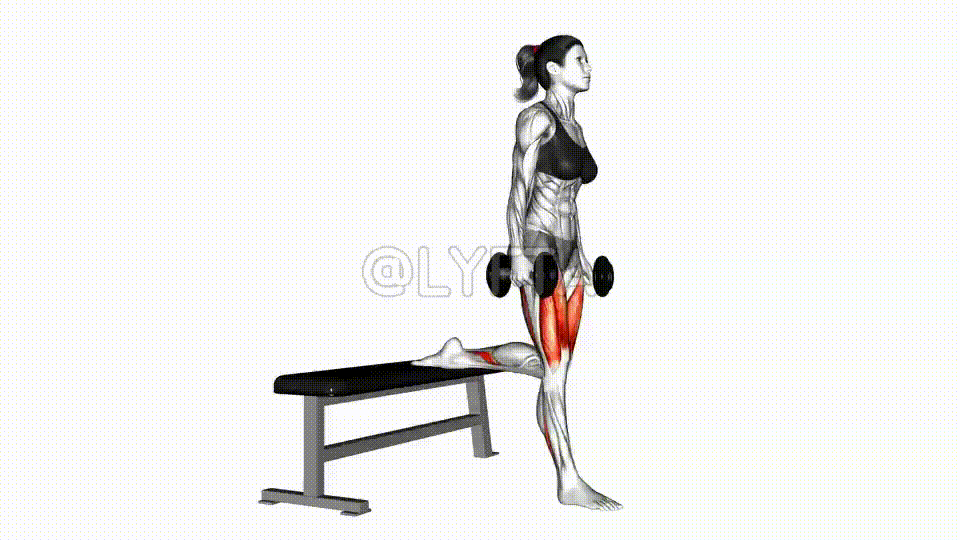

### 训练记录

- 2025 年 04 月 05 日，两个腿各 3 组，每组 12 个

### 动作参考

- [https://lyfta.app/zh-CN/ex/7v6](https://lyfta.app/zh-CN/ex/7v6)

## 哑铃箭步蹲 / Dumbbell lunge

目的：锻炼股四头肌、臀大肌和腘绳肌，提升单腿力量、平衡性和动态稳定性，同时强化核心肌群，有助于改善功能性运动表现

4 组，每组 12 到 20 个

- 下蹲时前腿的膝关节不要超过脚尖，身体重心在两腿之间
- 起立时身体不要前倾，要保持正直
- 详细细节可参考“箭步蹲加转体”，箭步蹲的动作要点是一致的

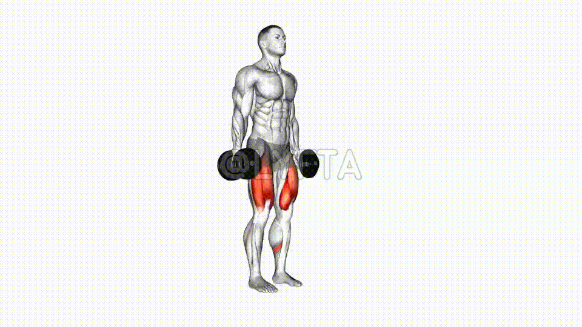

### 训练记录

- 2025 年 03 月 06 日，2.5kg * 2

### 动作参考

- [https://lyfta.app/zh-CN/ex/6is](https://lyfta.app/zh-CN/ex/6is)

## 箭步蹲加转体 / Lunge with Twist

目的：锻炼下肢力量与稳定性，同时强化核心旋转控制，提升身体协调性和功能性运动表现

2 组，每组 12 到 20 个（可以来回走）

- 双脚一前一后，脚尖朝向正前方，双脚的前后间距不要太大，距离只要保证下蹲的时候两个腿的大腿和小腿可以是垂直的即可
- 双脚的水平距离可以大一些，与肩同宽或略比肩宽，有助于站稳
- 全程保持核心收紧，肩胛骨向下向后向内收紧，沉肩挺胸，不要含胸驮背。全程应该保持骨盆和脊椎的上下、左右和前后都始终保持中立位。抬头目视正前方。不要低头或昂头
- 一只脚迈向正前方，往下蹲，蹲的时候一定要蹲下去，注意前侧的腿，膝盖不要超过脚尖，也不要内扣
- 假如左腿往前迈步，那么右手掰住左膝盖，然后左侧胳膊水平（一定要水平，不要越往外展胳膊越往下）向后打开，此时注意感受脊椎随之也在转动
- 双脚同时发力蹬地，挺起身体，后腿跟进到前腿位置

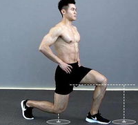
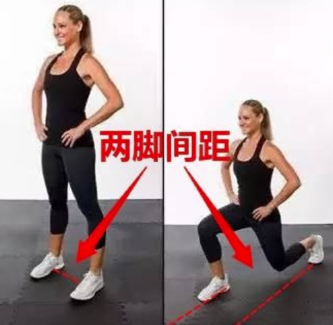
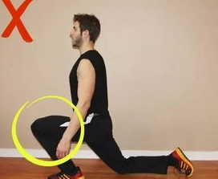
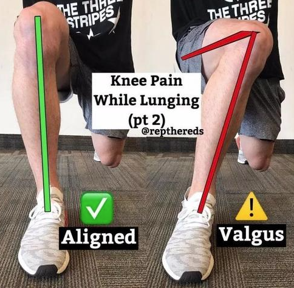
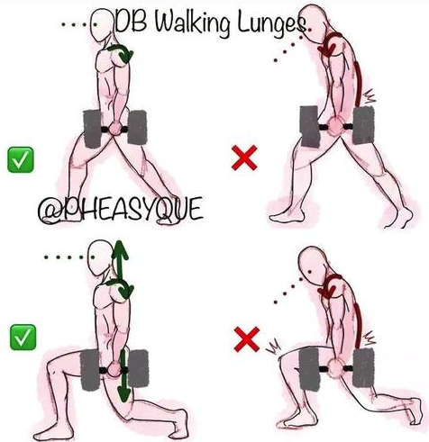
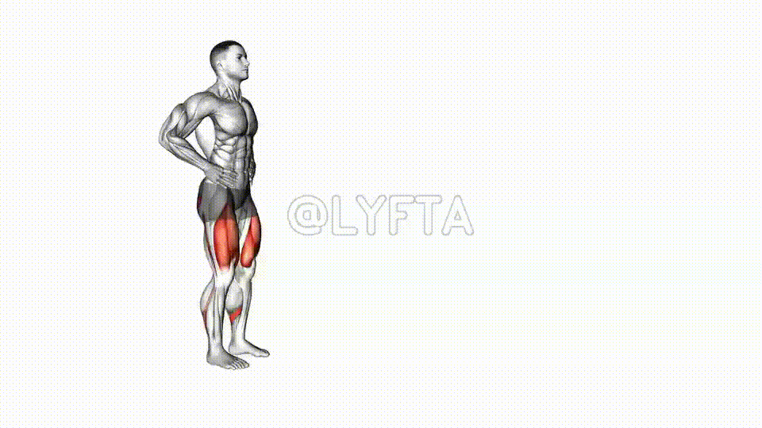
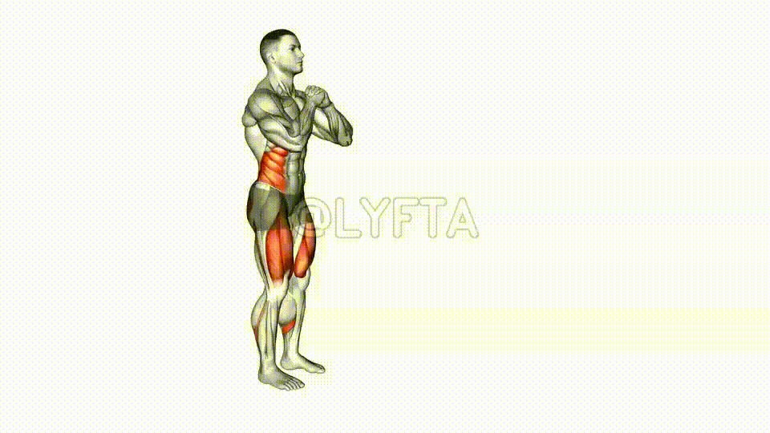

### 训练记录

- 2025 年 02 月 25 日
- 2025 年 03 月 09 日

### 动作参考

- [弓箭步教程：https://blog.sina.com.cn/s/blog_58d1a0b70102yxeh.html](https://blog.sina.com.cn/s/blog_58d1a0b70102yxeh.html)
- [https://lyfta.app/zh-CN/ex/7g6](https://lyfta.app/zh-CN/ex/7g6)
- [https://lyfta.app/zh-CN/ex/fm](https://lyfta.app/zh-CN/ex/fm)

# 有氧 / Cardio

## 战绳

目的：提升全身力量和耐力，尤其强化肩膀、手臂、核心和心肺功能，促进爆发力和代谢率，提高运动表现和体能水平

### 训练记录

- 2025 年 02 月 25 日
- 2025 年 03 月 06 日

# 肌肉

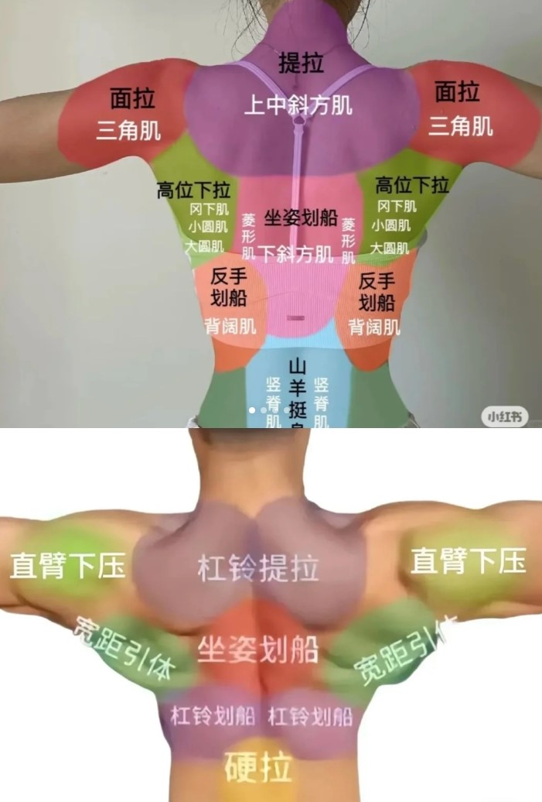

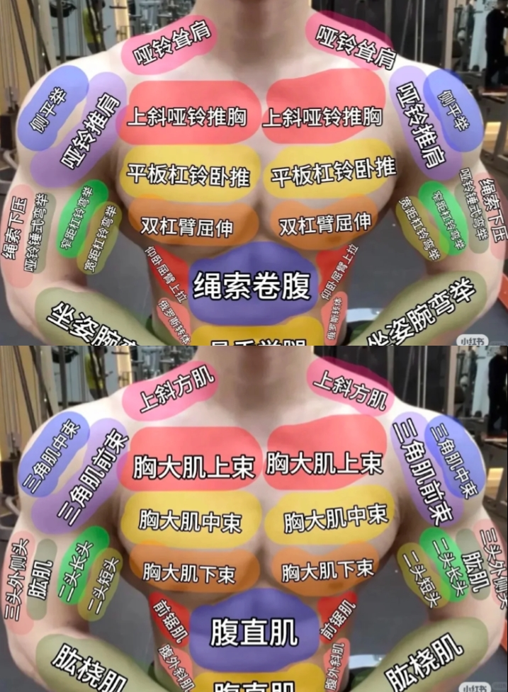

# 注意点

第一，始终保持：收腹、挺胸、降肋、沉肩

第二，稳定和控制比重量更重要

- 快拉慢放

第三，用力时呼气，还原时吸气

- 呼气：在出力阶段，比如推、拉、举起重量时
  
- 吸气：在还原阶段，比如放下重量、回到起始姿势时

第四，拉伸是训练不可或缺的一部分

第五，肌肉，休息很重要

第六，三分练，七分吃，十分睡

4 组可以可以逐步减重，加数量，也可以反着

## 健身发力感 tips

### 核心收紧

咳嗽时肚子瞬间绷紧的发力感（不是单纯吸肚子！）

### 正确屈髋

• 想象身后有凳子，屁股先「往后坐」（别弯腰！）

• 公共厕所「悬空蹲马桶」，用臀部和大腿后侧发力，腰保持中立。

屁股后移≠塌腰，腰别松！

### 沉肩不耸肩

• 想象腋下「夹体温计」，肩膀自然下沉（别用力夹！）

• 深吸气→叹气，感受肩膀「掉下来」，斜方肌放松。

### 肋骨下沉

• 嘴巴深吸气，充满胸腔→想象吹灭面前蜡烛，缓慢吐气

• 吐气时，肋骨主动「往下沉」，别让胸口「凸出来」。

### 臀部发力

想象「屁屁夹着一张纸」，用力夹紧保持纸不掉落，深蹲/硬拉时全程「夹纸感」。

### 硬拉收背

想象腋下夹一块「海绵」，用力挤压海绵「出水」，背部绷紧如「铁板」，避免圆肩弓背。

### 高位下拉找背感

双手「掰断杆子」的发力感，大臂贴近身体，用背阔肌「拉」动身体，不是用手臂「拽」！

### 肩胛骨稳定

想象肩胛骨「贴在后背」，与背部在同一平面，像「背了块平板」，避免耸肩或过度后缩。

# 相关链接

- [蜜蜂剪辑-视频转为 gif](https://beecut.cn/online-video-editor)

- [Lyfta](https://www.lyfta.app/zh-CN)

- [公斤轉換磅，磅轉換公斤 - 重量單位換算](https://www.ginifab.com.tw/tools/weight_converter/kilograms_to_pounds.html)

- [【干货】：一套完整的弹力带肩部热身动作](https://zhuanlan.zhihu.com/p/100225803)

- [健身房器械讲解｜辅助引体向上 紧致背部](https://www.bilibili.com/video/BV16T4y1a7Wh?spm_id_from=333.1387.favlist.content.click)

- [新手健身教学【坐姿腿弯举】动作讲解](https://www.bilibili.com/video/BV17Z4y1X769?spm_id_from=333.1387.favlist.content.click)

- [新手健身教学【坐姿腿屈伸】正确做法](https://www.bilibili.com/video/BV1YR4y1x7ya?spm_id_from=333.1387.favlist.content.click)

- [新手必看手把手教你：反向哈克机深蹲](https://www.bilibili.com/video/BV11k4y127f2?spm_id_from=333.1387.favlist.content.click)

- [倒蹬机腿举教程](https://zhuanlan.zhihu.com/p/84924435)

- [练背的经典动作坐姿划船](https://zhuanlan.zhihu.com/p/166001324)

- [坚持了一个月的“抬腿击掌”，背薄了腿细了](https://www.bilibili.com/video/BV1BU4y1x7md/?spm_id_from=333.337.search-card.all.click&vd_source=fc4264415d4564fe87b9d9921989718a)